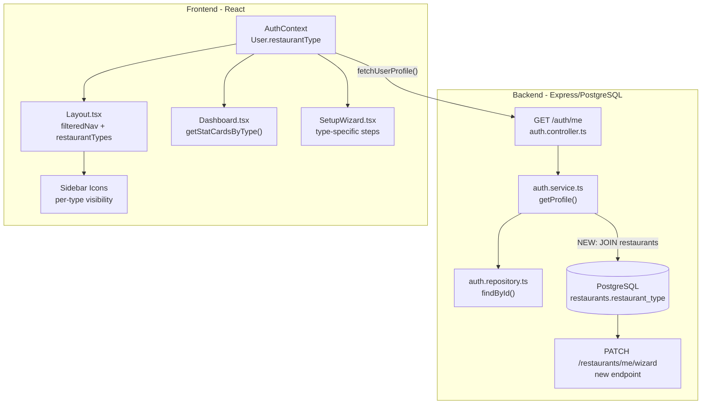
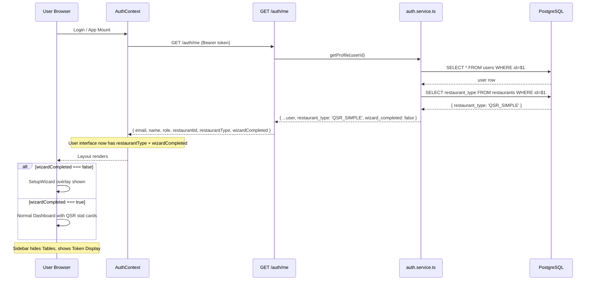

# Adaptive Restaurant Experience — Architecture Plan

## 1. Current State Analysis

### 1.1 Data Flow: Where `restaurant_type` Already Exists

| Layer | Location | Has `restaurant_type`? |
|-------|----------|----------------------|
| Database | `restaurants` table (migration 017) | ✅ Yes |
| Repository | [`restaurants.repository.ts`](src/modules/restaurants/restaurants.repository.ts:6) `findById()` | ✅ Yes (SELECT column) |
| Types | [`restaurants.types.ts`](src/modules/restaurants/restaurants.types.ts:66) `Restaurant` interface | ✅ Yes |
| GET /restaurants/me | [`restaurants.controller.ts`](src/modules/restaurants/restaurants.controller.ts:35) `getProfile()` | ✅ Yes (returns full Restaurant) |
| FeaturesContext | [`FeaturesContext.tsx`](client/src/contexts/FeaturesContext.tsx:58) fetches `/restaurants/me` | ✅ Available but unused |
| Auth Profile (GET /auth/me) | [`auth.service.ts`](src/modules/auth/auth.service.ts:142) `getProfile()` | ❌ **MISSING** — only user columns |
| AuthUser type | [`auth.types.ts`](src/modules/auth/auth.types.ts:25) `AuthUser` interface | ❌ **MISSING** |
| Frontend AuthContext | [`AuthContext.tsx`](client/src/contexts/AuthContext.tsx:4) `User` interface | ❌ **MISSING** |
| Frontend Layout/Nav | [`Layout.tsx`](client/src/components/Layout.tsx:31) `NavItem` interface | ❌ **MISSING** (needs `restaurantTypes` filter) |
| Frontend Dashboard | [`Dashboard.tsx`](client/src/pages/Dashboard.tsx) stat cards | ❌ **Hardcoded** (4 static cards) |

### 1.2 Key Insight

`restaurant_type` is in the DB, the repository, and the restaurant profile endpoint (`/restaurants/me`).
But the **auth profile** endpoint (`GET /auth/me`) — which is what the frontend AuthContext calls — does NOT include it.
This is the single bridge that needs to be built.

### 1.3 Existing Patterns We Can Extend

- **NavItem filtering** in [`Layout.tsx:78-88`](client/src/components/Layout.tsx:78) already supports `superAdmin`, `roles`, and `featureKey` — adding `restaurantTypes` follows the exact same pattern
- **FeaturesContext** already uses a provider pattern that could be co-opted, but mixing restaurant profile data with feature flags is poor separation of concerns
- **AuthContext User interface** already normalizes snake_case → camelCase in `fetchUserProfile()` at line 55-73

---

## 2. Architecture Decision

### Decision: Expose `restaurant_type` through Auth Profile (GET /auth/me)

**Rationale:**
1. `restaurant_type` is a fundamental identity of the tenant — it belongs alongside `restaurantId` in the auth profile
2. Every component needs it (sidebar, dashboard, wizard, recommendations)
3. AuthContext is already accessed everywhere via `useAuth()`
4. Simplest change: one backend SQL JOIN, one frontend interface addition
5. Accessible immediately after login — no extra API call needed

**Alternative considered (rejected):** Adding `restaurantType` to `FeaturesContext`
- Rejected because `restaurant_type` is not a feature flag; it's tenant identity
- Would require components to call both `useAuth()` AND `useFeatures()` for basic identity

---

## 3. Architecture Overview



---

## 4. Incremental Build Plan (3 Phases)

### Phase 1: Foundation — Expose `restaurant_type` to Frontend

**Goal:** Every component can access `user.restaurantType` via `useAuth()`

#### Step 1.1 — Backend: Modify `getProfile()` to include `restaurant_type`

**File:** [`src/modules/auth/auth.service.ts`](src/modules/auth/auth.service.ts:142)

Change `getProfile()` from:
```typescript
async getProfile(userId: string): Promise<AuthUser> {
  const user = await authRepository.findById(userId);
  if (!user) throw new NotFoundError('User not found');
  return { ...user, is_super_admin: isSuperAdminEmail(user.email) };
}
```

To a version that also queries the restaurant's `restaurant_type`:
```typescript
async getProfile(userId: string): Promise<AuthUser & { restaurant_type?: string }> {
  const user = await authRepository.findById(userId);
  if (!user) throw new NotFoundError('User not found');
  
  // Fetch restaurant_type from restaurants table
  let restaurant_type: string | undefined;
  if (user.restaurant_id) {
    const { rows } = await query(
      'SELECT restaurant_type FROM restaurants WHERE id = $1 LIMIT 1',
      [user.restaurant_id]
    );
    restaurant_type = rows[0]?.restaurant_type;
  }
  
  return { ...user, is_super_admin: isSuperAdminEmail(user.email), restaurant_type };
}
```

#### Step 1.2 — Backend: Add `restaurant_type` to `AuthUser` type

**File:** [`src/modules/auth/auth.types.ts`](src/modules/auth/auth.types.ts:25)

Add `restaurant_type?: string` to the `AuthUser` interface.

#### Step 1.3 — Frontend: Add `restaurantType` to AuthContext User

**File:** [`client/src/contexts/AuthContext.tsx`](client/src/contexts/AuthContext.tsx:4)

Add `restaurantType?: string` to the `User` interface and normalize `restaurant_type` → `restaurantType` in `fetchUserProfile()`.

**TypeScript compilation check point:** Run `tsc --noEmit` in both `src/` and `client/`.

---

### Phase 2: Dynamic Sidebar + Adaptive Dashboard

**Goal:** Sidebar hides irrelevant modules; Dashboard shows type-specific stats.

#### Step 2.1 — Define restaurant-type-to-nav mapping

Create a shared config constant (could go in a new file `client/src/config/restaurantTypes.ts` or inline in Layout.tsx):

| Nav Item | FULL_SERVICE | QSR_SIMPLE | QSR_CHAIN | CAFE | CLOUD_KITCHEN | HYBRID |
|----------|:---:|:---:|:---:|:---:|:---:|:---:|
| Dashboard | ✅ | ✅ | ✅ | ✅ | ✅ | ✅ |
| Orders | ✅ | ✅ | ✅ | ✅ | ✅ | ✅ |
| Tables | ✅ | ❌ | ❌ | ❌ | ❌ | ✅ |
| Menu | ✅ | ✅ | ✅ | ✅ | ✅ | ✅ |
| Token Display | ❌ | ✅ | ✅ | ❌ | ❌ | ✅ |
| Payments | ✅ | ✅ | ✅ | ✅ | ✅ | ✅ |
| Kitchen Display | ✅ | ✅ | ✅ | ✅ | ✅ | ✅ |
| Inventory | ✅ | ✅ | ✅ | ✅ | ✅ | ✅ |
| Users | ✅ | ✅ | ✅ | ✅ | ✅ | ✅ |
| Reports | ✅ | ✅ | ✅ | ✅ | ✅ | ✅ |
| QR Settings | ✅ | ❌ | ✅ | ❌ | ❌ | ✅ |
| Zomato | ❌ | ❌ | ❌ | ❌ | ✅ | ✅ |
| Subscription | ✅ | ✅ | ✅ | ✅ | ✅ | ✅ |
| Features | ✅ | ✅ | ✅ | ✅ | ✅ | ✅ |

#### Step 2.2 — Layout.tsx: Add `restaurantTypes` filter to NavItem

**File:** [`client/src/components/Layout.tsx`](client/src/components/Layout.tsx:31)

1. Add `restaurantTypes?: string[]` to the `NavItem` interface
2. Extend `filteredNav` (line 78-88) to also check restaurant type:
   ```typescript
   if (item.restaurantTypes && user?.restaurantType &&
       !item.restaurantTypes.includes(user.restaurantType)) return false
   ```
3. Add `restaurantTypes` to each relevant nav item definition in the `navItems` array

#### Step 2.3 — Dashboard.tsx: Adaptive stat cards

**File:** [`client/src/pages/Dashboard.tsx`](client/src/pages/Dashboard.tsx)

Create a `getStatCardsByType(type: string)` function that returns different card configs:

| Card | FULL_SERVICE | QSR | CAFE | CLOUD_KITCHEN | HYBRID |
|------|:---:|:---:|:---:|:---:|:---:|
| Revenue Today | ✅ | ✅ | ✅ | ✅ | ✅ |
| Total Orders | ✅ | ✅ | ✅ | ✅ | ✅ |
| Active Orders | ✅ | ✅ | ✅ | ✅ | ✅ |
| Occupied Tables | ✅ | ❌ | ❌ | ❌ | ✅ |
| Tokens Ready | ❌ | ✅ | ❌ | ❌ | ✅ |
| Orders Preparing | ❌ | ✅ | ❌ | ❌ | ✅ |
| Delivery Orders | ❌ | ❌ | ❌ | ✅ | ✅ |
| Aggregator Stats | ❌ | ❌ | ❌ | ✅ | ✅ |

Add new optional fields to `DashboardData` interface: `tokens_ready`, `orders_preparing`, `delivery_orders`, `aggregator_orders`.

**TypeScript compilation check point:** Run `tsc --noEmit` in `client/`.

---

### Phase 3: Setup Wizard

**Goal:** On first login, guide restaurant staff through type-specific setup.

#### Step 3.1 — Database: Add `wizard_completed` column

**Migration 018:**
```sql
ALTER TABLE restaurants ADD COLUMN wizard_completed BOOLEAN DEFAULT FALSE;
UPDATE restaurants SET wizard_completed = TRUE; -- existing restaurants skip wizard
```

#### Step 3.2 — Backend: Wizard completion endpoint

**New route:** `PATCH /api/v1/restaurants/me/wizard`

Marks `wizard_completed = true` for the current restaurant. Simple controller → service → repository flow.

#### Step 3.3 — New frontend component: `SetupWizard.tsx`

**File:** `client/src/components/SetupWizard.tsx`

Type-specific step definitions:

```
FULL_SERVICE:
  Step 1: Add Tables → link to /tables
  Step 2: Add Menu Categories → link to /menu
  Step 3: Configure GST → link to /qr-settings
  Step 4: Done → mark wizard_completed

QSR_SIMPLE / QSR_CHAIN:
  Step 1: Set Token Prefix → inline form
  Step 2: Add Menu Items → link to /menu
  Step 3: Configure Token Display → link to /kitchen
  Step 4: Done → mark wizard_completed

CAFE:
  Step 1: Add Menu Items with Modifiers → link to /menu
  Step 2: Configure Sizes/Variants → link to /menu/categories
  Step 3: Set Up Loyalty → link (future)
  Step 4: Done → mark wizard_completed

CLOUD_KITCHEN:
  Step 1: Add Packaging Options → link to /menu
  Step 2: Set Up Delivery Zones → link (future)
  Step 3: Connect Aggregator (Zomato) → link to /zomato-settings
  Step 4: Done → mark wizard_completed

HYBRID:
  Step 1: Add Tables → link to /tables
  Step 2: Set Token Prefix → inline form
  Step 3: Add Menu Items → link to /menu
  Step 4: Configure Both Channels → summary page
  Step 5: Done → mark wizard_completed
```

The wizard renders as a full-screen overlay on first login if `wizard_completed === false`.

#### Step 3.4 — AuthContext: Fetch wizard status

Add `wizardCompleted: boolean` to the User interface (fetched along with `restaurant_type` in the auth profile).

**TypeScript compilation check point:** Run `tsc --noEmit` in both `src/` and `client/`.

---

## 5. File Change Summary

### Backend Files (4 files changed, 1 new migration)

| File | Action | Description |
|------|--------|-------------|
| [`auth.types.ts`](src/modules/auth/auth.types.ts:25) | Modify | Add `restaurant_type?` and `wizard_completed?` to `AuthUser` |
| [`auth.service.ts`](src/modules/auth/auth.service.ts:142) | Modify | JOIN restaurants table in `getProfile()` |
| [`restaurants.controller.ts`](src/modules/restaurants/restaurants.controller.ts) | Modify | Add `completeWizard()` handler |
| [`restaurants.service.ts`](src/modules/restaurants/restaurants.service.ts) | Modify | Add `completeWizard()` method |
| Migration 018 | New | Add `wizard_completed` column to restaurants |

### Frontend Files (5 files changed, 2 new files)

| File | Action | Description |
|------|--------|-------------|
| [`AuthContext.tsx`](client/src/contexts/AuthContext.tsx) | Modify | Add `restaurantType`, `wizardCompleted` to User; normalize snake_case |
| [`Layout.tsx`](client/src/components/Layout.tsx) | Modify | Add `restaurantTypes` to NavItem; extend filteredNav logic; tag nav items |
| [`Dashboard.tsx`](client/src/pages/Dashboard.tsx) | Modify | `getStatCardsByType()` function; conditional card rendering |
| [`SetupWizard.tsx`](client/src/components/SetupWizard.tsx) | **New** | Type-specific setup wizard with steps |
| [`App.tsx`](client/src/App.tsx) | Modify | Render SetupWizard conditionally (if !wizardCompleted) |
| [`RestaurantTypes.ts`](client/src/config/restaurantTypes.ts) | **New** (optional) | Shared type labels, icons, and nav-visibility config |

---

## 6. Tenant Isolation & Backward Compatibility

### Guarantees

1. **No changes to JWT structure** — `restaurant_type` is only in the profile response, not the token
2. **No changes to middleware** — `authenticate` and `superAdmin` middleware unchanged
3. **No changes to `auth.repository.ts`** — `findById()` stays as-is; the JOIN happens in `auth.service.ts`
4. **Existing restaurants** — migration sets `wizard_completed = TRUE` so they skip the wizard
5. **Superadmin platform view** — superadmins have no `restaurant_type`; all nav items show for them (existing behavior via `isSuperAdmin` guard)
6. **No API contract break** — `GET /auth/me` returns a superset of previous fields (additive only)

---

## 7. Data Flow Diagram



---

## 8. Risks & Mitigations

| Risk | Mitigation |
|------|------------|
| Extra DB query on every profile fetch | Single indexed lookup on `restaurants.id` (PK); negligible overhead |
| Wizard appearing for existing restaurants | Migration sets `wizard_completed = TRUE` for all existing rows |
| Superadmin without restaurantId trying to get restaurant_type | Guard clause: only query if `user.restaurant_id` exists |
| Frontend normalization failing for missing field | Optional chaining: `restaurantType?: string` — defaults to undefined; all components handle undefined gracefully |

---

## 9. Incremental Acceptance Criteria

### Phase 1 Acceptance
- [ ] `GET /auth/me` response includes `restaurant_type` (test via curl/Postman)
- [ ] `user.restaurantType` accessible via `useAuth()` in any component
- [ ] TypeScript compiles cleanly in both `src/` and `client/`

### Phase 2 Acceptance
- [ ] QSR user sees "Token Display" in sidebar, no "Tables"
- [ ] FULL_SERVICE user sees "Tables" in sidebar, no "Token Display"
- [ ] CLOUD_KITCHEN user sees "Zomato" and "Delivery" nav items
- [ ] Dashboard stat cards change based on restaurant type
- [ ] All existing functionality unchanged for any restaurant type

### Phase 3 Acceptance
- [ ] First login after migration shows wizard for new restaurants (wizard_completed=false)
- [ ] Existing restaurants skip wizard (wizard_completed=true)
- [ ] Completing wizard calls PATCH /restaurants/me/wizard
- [ ] Wizard never shown again after completion