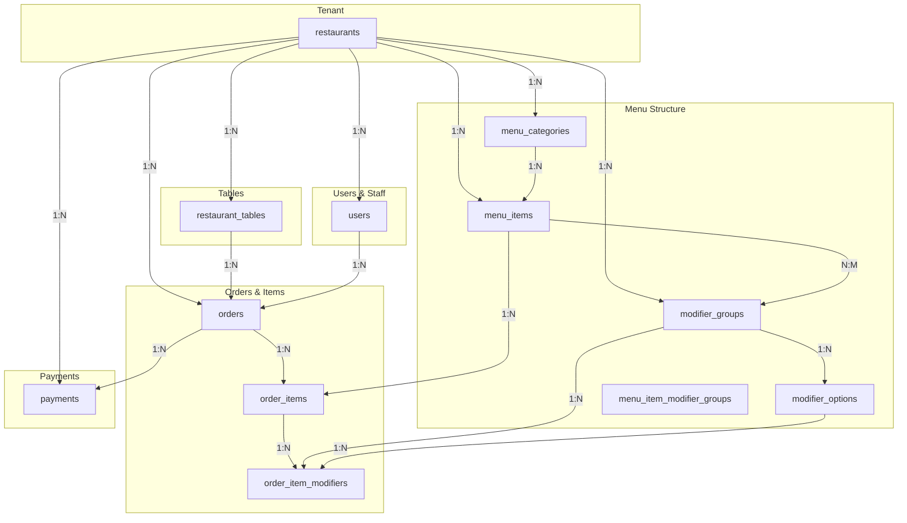

# AuraOS Waiter App Database Schema

## Overview

AuraOS uses PostgreSQL with multi-tenant architecture. All tables have a `restaurant_id` foreign key to support complete data isolation between restaurants.

---

## Core Tables

### restaurants

Root tenant table. Every restaurant in the system has one record.

**Purpose**: Define restaurant boundaries for multi-tenancy

| Column | Type | Constraints | Notes |
|--------|------|-----------|-------|
| `id` | UUID | PK | Auto-generated |
| `name` | VARCHAR(255) | NOT NULL | e.g., "Demo Kitchen" |
| `slug` | VARCHAR(255) | UNIQUE NOT NULL | For URL-friendly routing |
| `auto_approve_online_orders` | BOOLEAN | DEFAULT FALSE | Kitchen auto-accepts orders |
| `delay_threshold_minutes` | INTEGER | DEFAULT 15 | Alert if order > threshold |
| `created_at` | TIMESTAMP | DEFAULT NOW() | |
| `updated_at` | TIMESTAMP | DEFAULT NOW() | |

**Indexes**:
- `idx_restaurants_slug` - Fast lookup by slug

**SQL**:
```sql
SELECT * FROM restaurants WHERE id = $1;
```

---

### users

All staff members. Each user belongs to exactly one restaurant.

**Purpose**: Authentication, authorization, and staff management

| Column | Type | Constraints | Notes |
|--------|------|-----------|-------|
| `id` | UUID | PK | Auto-generated |
| `restaurant_id` | UUID | FK → restaurants | Tenant isolation |
| `email` | VARCHAR(255) | NOT NULL | Login credential |
| `password_hash` | VARCHAR(255) | NOT NULL | bcrypt(password) |
| `name` | VARCHAR(255) | NOT NULL | Display name |
| `role` | user_role | NOT NULL DEFAULT 'WAITER' | ADMIN, WAITER, RECEPTION, KITCHEN |
| `is_active` | BOOLEAN | DEFAULT TRUE | Soft deactivation |
| `created_at` | TIMESTAMP | DEFAULT NOW() | |
| `updated_at` | TIMESTAMP | DEFAULT NOW() | |

**Constraints**:
- `UNIQUE(restaurant_id, email)` - No duplicate emails per restaurant

**Indexes**:
- `idx_users_restaurant_id` - Tenant lookup
- `idx_users_email` - Login lookup
- `idx_users_role` - Role-based queries

**SQL**:
```sql
-- Login: find user by email and restaurant
SELECT * FROM users 
WHERE email = $1 AND restaurant_id = $2;

-- List all staff in restaurant
SELECT * FROM users 
WHERE restaurant_id = $1 AND is_active = TRUE
ORDER BY created_at DESC;
```

---

### restaurant_tables

Physical tables in the restaurant where customers sit.

**Purpose**: Track table inventory and occupancy

| Column | Type | Constraints | Notes |
|--------|------|-----------|-------|
| `id` | UUID | PK | Auto-generated |
| `restaurant_id` | UUID | FK → restaurants | Tenant isolation |
| `table_number` | VARCHAR(50) | NOT NULL | e.g., "T1", "Corner Table" |
| `seats` | INTEGER | NOT NULL DEFAULT 2 | Seating capacity |
| `is_active` | BOOLEAN | DEFAULT TRUE | Can this table be used? |
| `created_at` | TIMESTAMP | DEFAULT NOW() | |
| `updated_at` | TIMESTAMP | DEFAULT NOW() | |

**Constraints**:
- `UNIQUE(restaurant_id, table_number)` - Table numbers unique per restaurant

**Indexes**:
- `idx_restaurant_tables_restaurant_id` - Tenant lookup

**SQL**:
```sql
-- Get all active tables
SELECT * FROM restaurant_tables 
WHERE restaurant_id = $1 AND is_active = TRUE
ORDER BY table_number;

-- Get table with occupancy info
SELECT rt.*, 
       (SELECT order_id FROM orders 
        WHERE table_id = rt.id AND status != 'COMPLETED' 
        LIMIT 1) as active_order_id
FROM restaurant_tables rt
WHERE rt.restaurant_id = $1 AND rt.is_active = TRUE;
```

---

### menu_categories

Categories within a restaurant's menu (e.g., "Beverages", "Appetizers").

**Purpose**: Organize menu items

| Column | Type | Constraints | Notes |
|--------|------|-----------|-------|
| `id` | UUID | PK | Auto-generated |
| `restaurant_id` | UUID | FK → restaurants | Tenant isolation |
| `name` | VARCHAR(255) | NOT NULL | e.g., "Beverages" |
| `description` | TEXT | | Optional category description |
| `display_order` | INTEGER | DEFAULT 0 | Sort order in UI |
| `is_active` | BOOLEAN | DEFAULT TRUE | Hide inactive categories |
| `created_at` | TIMESTAMP | DEFAULT NOW() | |
| `updated_at` | TIMESTAMP | DEFAULT NOW() | |

**Constraints**:
- `UNIQUE(restaurant_id, name)` - Names unique per restaurant

**Indexes**:
- `idx_menu_categories_restaurant_id` - Tenant lookup
- `idx_menu_categories_active` - Filter by active

**SQL**:
```sql
-- Get all active categories
SELECT * FROM menu_categories 
WHERE restaurant_id = $1 AND is_active = TRUE
ORDER BY display_order, name;
```

---

### menu_items

Individual menu items (dishes, drinks).

**Purpose**: Define what can be ordered

| Column | Type | Constraints | Notes |
|--------|------|-----------|-------|
| `id` | UUID | PK | Auto-generated |
| `restaurant_id` | UUID | FK → restaurants | Tenant isolation |
| `category_id` | UUID | FK → menu_categories | ON DELETE CASCADE |
| `name` | VARCHAR(255) | NOT NULL | e.g., "Latte" |
| `description` | TEXT | | Optional description |
| `price` | DECIMAL(10,2) | NOT NULL | Base price in rupees |
| `prep_time_minutes` | INTEGER | DEFAULT 15 | Kitchen prep estimate |
| `is_vegetarian` | BOOLEAN | DEFAULT FALSE | Dietary info |
| `is_active` | BOOLEAN | DEFAULT TRUE | Can this be ordered? |
| `display_order` | INTEGER | DEFAULT 0 | Sort in category |
| `created_at` | TIMESTAMP | DEFAULT NOW() | |
| `updated_at` | TIMESTAMP | DEFAULT NOW() | |

**Constraints**:
- `UNIQUE(restaurant_id, name)` - Item names unique per restaurant
- `price > 0` - Positive prices only

**Indexes**:
- `idx_menu_items_restaurant_id` - Tenant lookup
- `idx_menu_items_category_id` - Category lookup
- `idx_menu_items_active` - Filter by active

**SQL**:
```sql
-- Get all items in a category
SELECT * FROM menu_items 
WHERE restaurant_id = $1 AND category_id = $2 AND is_active = TRUE
ORDER BY display_order;

-- Search items
SELECT * FROM menu_items 
WHERE restaurant_id = $1 AND is_active = TRUE 
AND name ILIKE '%' || $2 || '%'
ORDER BY display_order;
```

---

### modifier_groups

Groups of modifiers (e.g., "Size", "Milk Type"). Used to customize menu items.

**Purpose**: Define customization options

| Column | Type | Constraints | Notes |
|--------|------|-----------|-------|
| `id` | UUID | PK | Auto-generated |
| `restaurant_id` | UUID | FK → restaurants | Tenant isolation |
| `name` | VARCHAR(255) | NOT NULL | e.g., "Size" |
| `selection_type` | VARCHAR(10) | CHECK 'single'\|'multiple' | Radio vs checkbox |
| `min_select` | INTEGER | DEFAULT 0 | Minimum selections |
| `max_select` | INTEGER | DEFAULT 1 | Maximum selections |
| `sort_order` | INTEGER | DEFAULT 0 | Display order |
| `is_active` | BOOLEAN | DEFAULT TRUE | |
| `created_at` | TIMESTAMP | DEFAULT NOW() | |
| `updated_at` | TIMESTAMP | DEFAULT NOW() | |

**Constraints**:
- `UNIQUE(restaurant_id, name)` - Group names unique per restaurant

**Indexes**:
- `idx_modifier_groups_restaurant` - Tenant lookup

**SQL**:
```sql
-- Get modifier groups for a menu item
SELECT mg.* FROM modifier_groups mg
JOIN menu_item_modifier_groups mimgm ON mg.id = mimgm.modifier_group_id
WHERE mimgm.menu_item_id = $1 AND mg.is_active = TRUE
ORDER BY mimgm.sort_order;
```

---

### modifier_options

Individual options within a modifier group (e.g., "Small", "Medium", "Large").

**Purpose**: Define choices for customization

| Column | Type | Constraints | Notes |
|--------|------|-----------|-------|
| `id` | UUID | PK | Auto-generated |
| `modifier_group_id` | UUID | FK → modifier_groups | ON DELETE CASCADE |
| `name` | VARCHAR(255) | NOT NULL | e.g., "Large" |
| `price_adjustment` | DECIMAL(10,2) | DEFAULT 0 | Additional cost |
| `sort_order` | INTEGER | DEFAULT 0 | Display order |
| `is_active` | BOOLEAN | DEFAULT TRUE | |
| `created_at` | TIMESTAMP | DEFAULT NOW() | |
| `updated_at` | TIMESTAMP | DEFAULT NOW() | |

**Constraints**:
- `UNIQUE(modifier_group_id, name)` - Names unique per group

**Indexes**:
- `idx_modifier_options_group` - Group lookup

**SQL**:
```sql
-- Get all options in a modifier group
SELECT * FROM modifier_options 
WHERE modifier_group_id = $1 AND is_active = TRUE
ORDER BY sort_order;
```

---

### menu_item_modifier_groups

Junction table linking menu items to modifier groups.

**Purpose**: Specify which modifiers apply to which items

| Column | Type | Constraints | Notes |
|--------|------|-----------|-------|
| `id` | UUID | PK | Auto-generated |
| `menu_item_id` | UUID | FK → menu_items | ON DELETE CASCADE |
| `modifier_group_id` | UUID | FK → modifier_groups | ON DELETE CASCADE |
| `sort_order` | INTEGER | DEFAULT 0 | Display order |
| `created_at` | TIMESTAMP | DEFAULT NOW() | |

**Constraints**:
- `UNIQUE(menu_item_id, modifier_group_id)` - No duplicates

**Indexes**:
- `idx_mimg_menu_item` - Item lookup
- `idx_mimg_modifier_group` - Group lookup

**SQL**:
```sql
-- Get all modifiers for a menu item
SELECT mg.* FROM modifier_groups mg
JOIN menu_item_modifier_groups mimgm ON mg.id = mimgm.modifier_group_id
WHERE mimgm.menu_item_id = $1
ORDER BY mimgm.sort_order;
```

---

## Order Tables

### orders

Master order record. Represents a complete order placed by a waiter.

**Purpose**: Track order lifecycle from creation to completion

| Column | Type | Constraints | Notes |
|--------|------|-----------|-------|
| `id` | UUID | PK | Auto-generated |
| `restaurant_id` | UUID | FK → restaurants | Tenant isolation |
| `table_id` | UUID | FK → restaurant_tables | ON DELETE SET NULL | Nullable for takeaway |
| `order_number` | VARCHAR(50) | NOT NULL | e.g., "ORD-001" |
| `token_number` | VARCHAR(50) | | Takeaway receipt number |
| `order_type` | order_type | NOT NULL | DINE_IN, PARCEL, ONLINE |
| `order_source` | order_source | NOT NULL | WAITER, RECEPTION, QR, WHATSAPP, ZOMATO |
| `status` | order_status | DEFAULT 'CREATED' | State machine |
| `total_amount` | DECIMAL(12,2) | DEFAULT 0 | Sum of items + modifiers |
| `priority_score` | INTEGER | DEFAULT 0 | Kitchen priority |
| `special_instructions` | TEXT | | e.g., "No onions" |
| `created_by` | UUID | FK → users | ON DELETE SET NULL | Which waiter created |
| `created_at` | TIMESTAMP | DEFAULT NOW() | |
| `updated_at` | TIMESTAMP | DEFAULT NOW() | |
| `completed_at` | TIMESTAMP | | When order finished |

**Constraints**:
- `UNIQUE(restaurant_id, order_number)` - Order numbers unique per restaurant
- `total_amount >= 0` - No negative amounts

**Indexes**:
- `idx_orders_restaurant_id` - Tenant lookup
- `idx_orders_status` - Filter by status
- `idx_orders_table_id` - Find orders for table
- `idx_orders_created_at_desc` - Recent orders
- `idx_orders_restaurant_status` - Tenant + status (hot)
- `idx_orders_priority_score` - Kitchen display order

**SQL**:
```sql
-- Get all pending orders for a restaurant (kitchen view)
SELECT * FROM orders 
WHERE restaurant_id = $1 AND status IN ('CREATED', 'ACCEPTED', 'PREPARING')
ORDER BY priority_score DESC, created_at ASC;

-- Get active order for a table
SELECT * FROM orders 
WHERE table_id = $1 AND status NOT IN ('COMPLETED', 'CANCELLED')
LIMIT 1;

-- Get orders by status today
SELECT * FROM orders 
WHERE restaurant_id = $1 
  AND status = $2
  AND created_at::DATE = CURRENT_DATE
ORDER BY created_at DESC;
```

---

### order_items

Line items within an order. Each order has multiple items.

**Purpose**: Track individual dishes/drinks in an order

| Column | Type | Constraints | Notes |
|--------|------|-----------|-------|
| `id` | UUID | PK | Auto-generated |
| `restaurant_id` | UUID | FK → restaurants | Tenant isolation |
| `order_id` | UUID | FK → orders | ON DELETE CASCADE |
| `menu_item_id` | UUID | FK → menu_items | ON DELETE RESTRICT |
| `quantity` | INTEGER | NOT NULL DEFAULT 1 | How many of this item |
| `unit_price` | DECIMAL(10,2) | NOT NULL | Price at time of order |
| `special_instructions` | TEXT | | e.g., "No ice" |
| `status` | item_status | DEFAULT 'PENDING' | PENDING, PREPARING, DONE |
| `created_at` | TIMESTAMP | DEFAULT NOW() | |
| `updated_at` | TIMESTAMP | DEFAULT NOW() | |
| `completed_at` | TIMESTAMP | | When item finished cooking |

**Constraints**:
- `quantity >= 1` - Must be positive

**Indexes**:
- `idx_order_items_restaurant_id` - Tenant lookup
- `idx_order_items_order_id` - Items in order
- `idx_order_items_menu_item_id` - Item analytics
- `idx_order_items_status` - Kitchen status

**SQL**:
```sql
-- Get all items in an order
SELECT oi.*, mi.name as menu_item_name
FROM order_items oi
JOIN menu_items mi ON oi.menu_item_id = mi.id
WHERE oi.order_id = $1
ORDER BY oi.created_at;

-- Get kitchen items (by status)
SELECT oi.*, mi.name, o.order_number
FROM order_items oi
JOIN menu_items mi ON oi.menu_item_id = mi.id
JOIN orders o ON oi.order_id = o.id
WHERE oi.restaurant_id = $1 AND oi.status = $2
ORDER BY o.priority_score DESC, oi.created_at;
```

---

### order_item_modifiers

Modifiers selected for a specific order item. Denormalized for bill printing.

**Purpose**: Store modifier choices and price adjustments

| Column | Type | Constraints | Notes |
|--------|------|-----------|-------|
| `id` | UUID | PK | Auto-generated |
| `order_item_id` | UUID | FK → order_items | ON DELETE CASCADE |
| `modifier_group_id` | UUID | FK → modifier_groups | ON DELETE RESTRICT |
| `modifier_group_name` | VARCHAR(255) | NOT NULL | Denormalized |
| `modifier_option_id` | UUID | FK → modifier_options | ON DELETE RESTRICT |
| `modifier_option_name` | VARCHAR(255) | NOT NULL | Denormalized |
| `price_adjustment` | DECIMAL(10,2) | DEFAULT 0 | Additional cost |
| `created_at` | TIMESTAMP | DEFAULT NOW() | |

**Indexes**:
- `idx_oim_order_item` - Find modifiers for item

**SQL**:
```sql
-- Get all modifiers for an order item (for bill)
SELECT * FROM order_item_modifiers 
WHERE order_item_id = $1
ORDER BY created_at;

-- Calculate total price for item with modifiers
SELECT 
  oi.quantity * (oi.unit_price + COALESCE(SUM(oim.price_adjustment), 0)) as item_total
FROM order_items oi
LEFT JOIN order_item_modifiers oim ON oi.id = oim.order_item_id
WHERE oi.id = $1
GROUP BY oi.id, oi.quantity, oi.unit_price;
```

---

## Payment Tables

### payments

Payment records for orders.

**Purpose**: Track financial transactions

| Column | Type | Constraints | Notes |
|--------|------|-----------|-------|
| `id` | UUID | PK | Auto-generated |
| `restaurant_id` | UUID | FK → restaurants | Tenant isolation |
| `order_id` | UUID | FK → orders | Multiple payments per order possible |
| `amount` | DECIMAL(12,2) | NOT NULL | Payment amount |
| `method` | payment_method | NOT NULL | CASH, CARD, UPI, ONLINE |
| `status` | payment_status | DEFAULT 'PENDING' | PENDING, PAID, REFUNDED |
| `reference_number` | VARCHAR(255) | | e.g., transaction ID |
| `created_at` | TIMESTAMP | DEFAULT NOW() | |
| `updated_at` | TIMESTAMP | DEFAULT NOW() | |

**Indexes**:
- `idx_payments_restaurant_id` - Tenant lookup
- `idx_payments_order_id` - Payments for order
- `idx_payments_status` - Filter by status
- `idx_payments_created_at` - Recent payments

**SQL**:
```sql
-- Get payments for an order
SELECT * FROM payments 
WHERE order_id = $1 
ORDER BY created_at DESC;

-- Get revenue today
SELECT 
  SUM(amount) as total_revenue,
  COUNT(*) as payment_count,
  COUNT(DISTINCT order_id) as order_count
FROM payments 
WHERE restaurant_id = $1 
  AND status = 'PAID'
  AND created_at::DATE = CURRENT_DATE;

-- Payment method breakdown
SELECT method, SUM(amount) as total, COUNT(*) as count
FROM payments 
WHERE restaurant_id = $1 AND status = 'PAID'
  AND created_at::DATE = CURRENT_DATE
GROUP BY method;
```

---

## Relationships Diagram



---

## Query Patterns

### Get Complete Menu for Waiter App

```sql
SELECT 
  c.id, c.name as category_name, c.display_order as category_order,
  i.id, i.name as item_name, i.price, i.prep_time_minutes, 
  i.is_vegetarian, i.display_order as item_order,
  json_agg(
    json_build_object(
      'id', mg.id,
      'name', mg.name,
      'selection_type', mg.selection_type,
      'options', (
        SELECT json_agg(
          json_build_object('id', mo.id, 'name', mo.name, 'price_adjustment', mo.price_adjustment)
        ) FROM modifier_options mo
        WHERE mo.modifier_group_id = mg.id AND mo.is_active = TRUE
      )
    )
  ) as modifiers
FROM menu_categories c
JOIN menu_items i ON c.id = i.category_id
LEFT JOIN menu_item_modifier_groups mimgm ON i.id = mimgm.menu_item_id
LEFT JOIN modifier_groups mg ON mimgm.modifier_group_id = mg.id
WHERE c.restaurant_id = $1 AND c.is_active = TRUE 
  AND i.is_active = TRUE AND (mg.is_active IS NULL OR mg.is_active = TRUE)
GROUP BY c.id, c.name, c.display_order, i.id, i.name, i.price, i.prep_time_minutes, i.is_vegetarian, i.display_order
ORDER BY c.display_order, c.name, i.display_order, i.name;
```

### Get Order with Complete Details

```sql
SELECT 
  o.id, o.order_number, o.status, o.total_amount, o.table_id,
  json_build_object('id', t.id, 'table_number', t.table_number) as table_info,
  json_agg(
    json_build_object(
      'id', oi.id,
      'menu_item_id', oi.menu_item_id,
      'menu_item_name', mi.name,
      'quantity', oi.quantity,
      'unit_price', oi.unit_price,
      'status', oi.status,
      'modifiers', (
        SELECT json_agg(
          json_build_object(
            'modifier_group_name', oim.modifier_group_name,
            'modifier_option_name', oim.modifier_option_name,
            'price_adjustment', oim.price_adjustment
          )
        ) FROM order_item_modifiers oim
        WHERE oim.order_item_id = oi.id
      )
    )
  ) as items
FROM orders o
LEFT JOIN restaurant_tables t ON o.table_id = t.id
JOIN order_items oi ON o.id = oi.order_id
JOIN menu_items mi ON oi.menu_item_id = mi.id
WHERE o.id = $1 AND o.restaurant_id = $2
GROUP BY o.id, o.order_number, o.status, o.total_amount, o.table_id, t.id, t.table_number;
```

---

## Performance Tuning

### Index Strategy

1. **Hot Indexes** (used in every request):
   - `idx_orders_restaurant_status` - Kitchen dashboard
   - `idx_tables_restaurant_id` - Table list
   - `idx_menu_items_restaurant_id, is_active` - Menu display

2. **Warm Indexes** (used frequently):
   - `idx_users_restaurant_id` - User lookups
   - `idx_payments_restaurant_id` - Payment queries

3. **Cold Indexes** (used rarely):
   - `idx_orders_created_at_desc` - Reporting
   - `idx_menu_items_active` - Filter operations

### Partitioning (for scale)

For very large restaurants, partition orders table by date:

```sql
CREATE TABLE orders_2026_06 PARTITION OF orders
  FOR VALUES FROM ('2026-06-01') TO ('2026-07-01');
```

---

## Data Integrity

### Cascading Deletes

- Deleting a restaurant cascades to all its data
- Deleting an order cascades to its items and modifiers
- Deleting a menu item RESTRICTS (can't delete items with order history)

### Transaction Safety

All order operations are wrapped in transactions:

```sql
BEGIN;
  INSERT INTO orders (...) RETURNING id;
  INSERT INTO order_items (...);
  INSERT INTO order_item_modifiers (...);
  UPDATE restaurants SET updated_at = NOW() WHERE id = $1;
COMMIT;
```

---

## Backup Strategy

Recommended backup approach:

```bash
# Full backup
pg_dump auraos > backup_full.sql

# Filtered backup (single restaurant)
pg_dump --data-only -t "restaurants" -t "orders*" auraos > backup_restaurant.sql

# Point-in-time recovery
pg_basebackup -D /backups/base -Fplain -P
```
