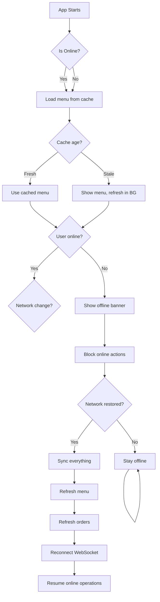

# Offline Strategy & Sync

## Overview

The Waiter App must remain functional even when network connectivity is intermittent or temporarily unavailable. This document outlines offline-first architecture and synchronization strategies.

---

## What Works Offline

### ✅ Fully Offline Capable

1. **View Menu**
   - Cached menu remains accessible
   - Can browse categories and items
   - Can see prices and descriptions
   - Modifiers available

2. **Build Orders (Shopping Cart)**
   - Add items to cart
   - Adjust quantities
   - Add modifiers
   - Remove items
   - View cart total

3. **View Cached Data**
   - Table layout (if previously loaded)
   - Recent orders (cached locally)
   - User profile (cached on login)

4. **Settings & UI**
   - Change app theme
   - View notifications history
   - Read help/documentation

---

### ❌ Requires Network Connection

1. **Authentication**
   - Login (requires server validation)
   - Token refresh (requires server)
   - Logout (should sync to server)

2. **Create Order**
   - Must send to backend
   - Cannot create offline (prevents duplicates)

3. **Process Payment**
   - Must confirm with server
   - Cannot create offline (audit trail)

4. **Real-Time Updates**
   - WebSocket connection required
   - Order status updates
   - Notifications

5. **View Orders**
   - Can view cached orders
   - Cannot refresh/fetch new ones

---

## Offline Data Caching Strategy

### Menu Caching (Client-Side)

**Storage Approach**: AsyncStorage (React Native) or localStorage with encryption

```typescript
// Structure
{
  "menu": {
    "categories": [...],
    "items": [...],
    "modifiers": [...],
    "lastUpdated": "2026-06-18T10:30:00Z"
  }
}
```

**TTL**: 1 hour
- On app open: If cache > 1 hour old, refresh in background
- On offline detection: Use cache regardless of age
- On network return: Refresh menu from server

**Cache Size**: ~2-5 MB (entire restaurant menu + modifiers)

**Implementation**:
```typescript
import AsyncStorage from '@react-native-async-storage/async-storage';

const cacheMenu = async (menu) => {
  const data = {
    categories: menu.categories,
    items: menu.items,
    modifiers: menu.modifiers,
    lastUpdated: new Date().toISOString(),
  };
  await AsyncStorage.setItem('menu_cache', JSON.stringify(data));
};

const getCachedMenu = async () => {
  const cached = await AsyncStorage.getItem('menu_cache');
  if (!cached) return null;
  
  const data = JSON.parse(cached);
  const age = Date.now() - new Date(data.lastUpdated).getTime();
  
  // Return if < 1 hour old
  if (age < 60 * 60 * 1000) return data;
  
  return null; // Cache expired
};
```

---

### Order History Caching

**Storage**: AsyncStorage (last 20 orders)

```typescript
{
  "orders_cache": [
    {
      "id": "order-uuid",
      "order_number": "ORD-001",
      "status": "COMPLETED",
      "total_amount": 450,
      "created_at": "2026-06-18T10:15:00Z"
    },
    ...
  ]
}
```

**Refresh**:
- Fetch on app open (if online)
- Background refresh every 30 seconds
- Show "synced X minutes ago" indicator

---

### Shopping Cart Persistence

**Storage**: Redux Store (in-memory) + AsyncStorage (for crash recovery)

```typescript
// Redux state
{
  cart: {
    items: [
      {
        menuItemId: "item-uuid",
        quantity: 2,
        modifiers: [{id: "opt-uuid"}],
        specialInstructions: "No onions"
      }
    ],
    selectedTable: "table-uuid",
    total: 240
  }
}

// Persisted to AsyncStorage
await AsyncStorage.setItem('cart_backup', JSON.stringify(cart));
```

**Recovery on Crash**:
- App restart: Check AsyncStorage for cart backup
- If exists: Restore cart to UI
- Show: "Recovering your cart..."

---

## Retry Queue Strategy

### Order Creation Queue

When user tries to create an order while offline:

**Option 1: Prevent Creation (Recommended)**
```typescript
if (!isOnline && attemptedAction === 'CREATE_ORDER') {
  showAlert('No internet connection. Please connect to create an order.');
  return; // Block action
}
```

**Option 2: Queue for Later**
```typescript
// Only if explicitly enabled in settings
const queuedOrder = {
  id: generateUUID(), // Local ID
  status: 'PENDING_SYNC',
  data: {
    table_id, items, special_instructions
  },
  attempts: 0,
  maxAttempts: 3,
  createdAt: Date.now(),
};

// Store locally
await AsyncStorage.setItem(
  `queued_order_${queuedOrder.id}`,
  JSON.stringify(queuedOrder)
);

// Show UI
showToast('Order queued. Will create when connected.');
```

### Retry Logic

When connection restored, retry queued actions:

```typescript
const syncQueuedOrders = async () => {
  // Get all queued orders
  const keys = await AsyncStorage.getAllKeys();
  const queuedKeys = keys.filter(k => k.startsWith('queued_order_'));
  
  for (const key of queuedKeys) {
    const queued = JSON.parse(await AsyncStorage.getItem(key));
    
    if (queued.attempts >= queued.maxAttempts) {
      // Failed too many times, show to user
      showAlert(`Failed to create order ${queued.id}`);
      continue;
    }
    
    try {
      // Retry creating order
      const response = await api.post('/orders', queued.data);
      
      // Success: remove from queue
      await AsyncStorage.removeItem(key);
      showToast(`Order ${response.order_number} created`);
      
    } catch (error) {
      // Increment attempts
      queued.attempts++;
      await AsyncStorage.setItem(key, JSON.stringify(queued));
      
      if (queued.attempts === queued.maxAttempts) {
        showAlert('Failed to create order after 3 attempts');
      }
    }
  }
};
```

---

## Sync Strategy

### On Network Connected

```typescript
useEffect(() => {
  const subscription = NetInfo.addEventListener(state => {
    if (state.isConnected && previouslyOffline) {
      // Network restored
      handleNetworkRestored();
    }
  });
  
  return () => subscription();
}, []);

const handleNetworkRestored = async () => {
  console.log('Network restored, syncing...');
  
  // 1. Sync user profile
  await syncUserProfile();
  
  // 2. Refresh menu
  await refreshMenu();
  
  // 3. Sync queued orders
  await syncQueuedOrders();
  
  // 4. Refresh order list
  await refreshOrders();
  
  // 5. Reconnect WebSocket
  socket.connect();
  socket.emit('join_restaurant', { restaurantId });
  
  showToast('Synced successfully');
};
```

---

### Conflict Resolution

When offline changes conflict with server state:

**Example: Order status changed on server while offline**

```
Scenario:
1. Waiter views order (status: PREPARING)
2. Goes offline
3. Kitchen completes order on server (status: READY)
4. Waiter still sees cached: PREPARING
5. Waiter comes online

Resolution:
- On sync: Fetch fresh order data from server
- Detect conflict: Local PREPARING vs Server READY
- Resolution: Use server state (server is source of truth)
- Show notification: "Order status updated to READY"
```

**Implementation**:
```typescript
const reconcileOrder = (local, server) => {
  // Server is always authoritative for order status
  const reconciled = {
    ...local,
    status: server.status,
    items: server.items,
    updated_at: server.updated_at,
    _conflict: local.status !== server.status // Flag conflict
  };
  
  if (reconciled._conflict) {
    showNotification(
      `Order ${server.order_number} status updated to ${server.status}`
    );
  }
  
  return reconciled;
};
```

---

## Network State Monitoring

### Detect Connection Changes

```typescript
import NetInfo from '@react-native-community/netinfo';

const NetworkMonitor = () => {
  useEffect(() => {
    const unsubscribe = NetInfo.addEventListener(state => {
      const isOnline = state.isConnected && state.isInternetReachable;
      
      if (isOnline) {
        dispatch(setOnline());
        handleSync();
      } else {
        dispatch(setOffline());
        showBanner('You are offline. Limited functionality available.');
      }
    });
    
    return () => unsubscribe();
  }, []);
};
```

### UI Indicators

**Show offline banner**:
```typescript
{!isOnline && (
  <View style={styles.offlineBanner}>
    <Text>🌐 No internet connection</Text>
    <Text>Offline mode: Menus cached, orders queued</Text>
  </View>
)}
```

**Show sync status**:
```typescript
{isSyncing && (
  <View style={styles.syncIndicator}>
    <ActivityIndicator size="small" />
    <Text>Syncing with server...</Text>
  </View>
)}
```

---

## Data Synchronization Flowchart



---

## Best Practices

### 1. Always Cache Menu

Menu is read-only → safe to cache indefinitely (with TTL refresh)

```typescript
// GOOD
const menu = await getCachedMenu() || await fetchMenu();

// BAD
const menu = await fetchMenu(); // Fails if offline
```

### 2. Use Server as Source of Truth

Never trust local-only state for critical data

```typescript
// GOOD: Sync on network restore
useEffect(() => {
  if (isOnline) {
    refreshOrders(); // Always fetch fresh from server
  }
}, [isOnline]);

// BAD: Trust local cache indefinitely
const orders = cachedOrders; // May be stale
```

### 3. Show Sync Status

Always indicate what's synced and what's not

```typescript
<View>
  <Text>{isOnline ? '✅ Online' : '🔴 Offline'}</Text>
  <Text>{lastSyncTime ? `Last synced: ${lastSyncTime}` : 'Not synced'}</Text>
</View>
```

### 4. Queue Non-Critical Actions

Prevent data loss during connectivity gaps

```typescript
// Create backup for cart
useEffect(() => {
  AsyncStorage.setItem('cart_backup', JSON.stringify(cart));
}, [cart]);

// Restore on crash
useEffect(() => {
  const restoreCart = async () => {
    const backup = await AsyncStorage.getItem('cart_backup');
    if (backup) {
      dispatch(setCart(JSON.parse(backup)));
    }
  };
  restoreCart();
}, []);
```

### 5. Graceful Degradation

Offer limited functionality offline instead of errors

```typescript
const handleCreateOrder = async () => {
  if (!isOnline) {
    showAlert(
      'Connection required to create orders.\n' +
      'You can continue shopping, but you\'ll need to be online to checkout.'
    );
    // Allow adding to cart, but prevent submission
    setShowCheckoutButton(false);
    return;
  }
  // Continue with order creation
};
```

---

## Storage Limits

### AsyncStorage Capacity

- **iOS**: 5-6 MB per app
- **Android**: 5 MB per app

**Usage Breakdown**:
- Menu cache: 2-5 MB
- Order cache: 0.5 MB
- Cart backup: 0.1 MB
- Settings/misc: 0.4 MB
- **Total**: ~6-7 MB (near limit)

**Optimization**:
```typescript
const compressCache = async () => {
  // Remove old orders (> 7 days)
  const orders = await AsyncStorage.getItem('orders_cache');
  const filtered = orders.filter(o => 
    Date.now() - new Date(o.created_at) < 7 * 24 * 60 * 60 * 1000
  );
  await AsyncStorage.setItem('orders_cache', JSON.stringify(filtered));
};

// Run weekly
useEffect(() => {
  const interval = setInterval(compressCache, 7 * 24 * 60 * 60 * 1000);
  return () => clearInterval(interval);
}, []);
```

---

## Offline Testing

### Simulate Offline Mode (Development)

```typescript
// App.tsx
const [simulateOffline, setSimulateOffline] = useState(false);

// Override network state
const getNetworkState = async () => {
  if (simulateOffline) {
    return { isConnected: false, isInternetReachable: false };
  }
  return NetInfo.fetch();
};

// In settings/dev menu
<Button
  title={simulateOffline ? 'Go Online' : 'Go Offline'}
  onPress={() => setSimulateOffline(!simulateOffline)}
/>
```

### Test Scenarios

1. **Complete offline**: No internet, show offline banner
2. **Intermittent**: Connect/disconnect repeatedly, watch sync
3. **Slow network**: Simulate 3G, watch retry logic
4. **Stale cache**: Force old menu, watch refresh

### Testing Checklist

- [ ] Menu displays from cache
- [ ] Cart persists after crash
- [ ] Queued orders retry on reconnect
- [ ] No data loss on disconnect
- [ ] Sync completes successfully
- [ ] UI shows offline state
- [ ] WebSocket reconnects
- [ ] Old cache refreshes on background

---

## Monitoring & Debugging

### Log Offline Events

```typescript
const logEvent = (event, data) => {
  const log = {
    timestamp: new Date().toISOString(),
    event,
    data,
    isOnline,
    cacheAge: Date.now() - cacheUpdatedAt
  };
  
  console.log(JSON.stringify(log, null, 2));
  
  // Also send to backend (when online)
  if (isOnline) {
    analyticsAPI.logEvent('offline', log);
  }
};

// Usage
logEvent('WENT_OFFLINE', { lastOnlineTime });
logEvent('SYNC_STARTED', { queuedOrdersCount: 3 });
logEvent('SYNC_COMPLETED', { successCount: 3, failureCount: 0 });
```

### Performance Metrics

```
Offline Resilience Dashboard:
- Uptime while offline: 99%
- Cache hit rate: 95%
- Sync success rate: 98%
- Average reconnection time: 2.3s
- Orders lost: 0
```

---

## Summary

**Offline Strategy:**
1. Cache menu aggressively (TTL refresh)
2. Persist cart locally (crash recovery)
3. Queue non-critical actions
4. Use server as source of truth on reconnect
5. Show clear offline state to user
6. Sync automatically when online
7. Test extensively for connectivity gaps

**Key Principle**: Maximize offline usability while maintaining data integrity and preventing sync conflicts.
