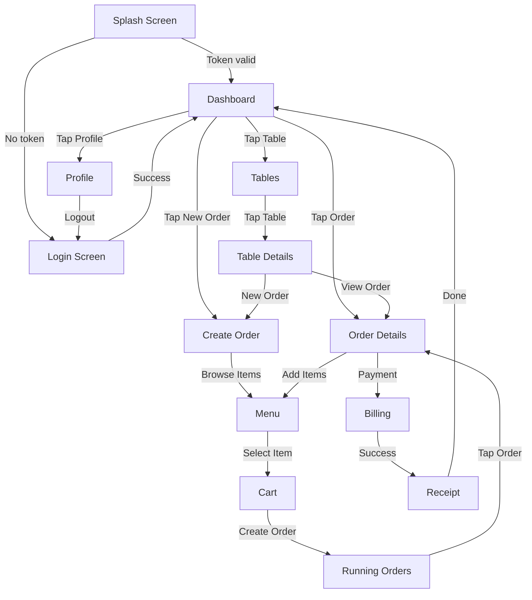
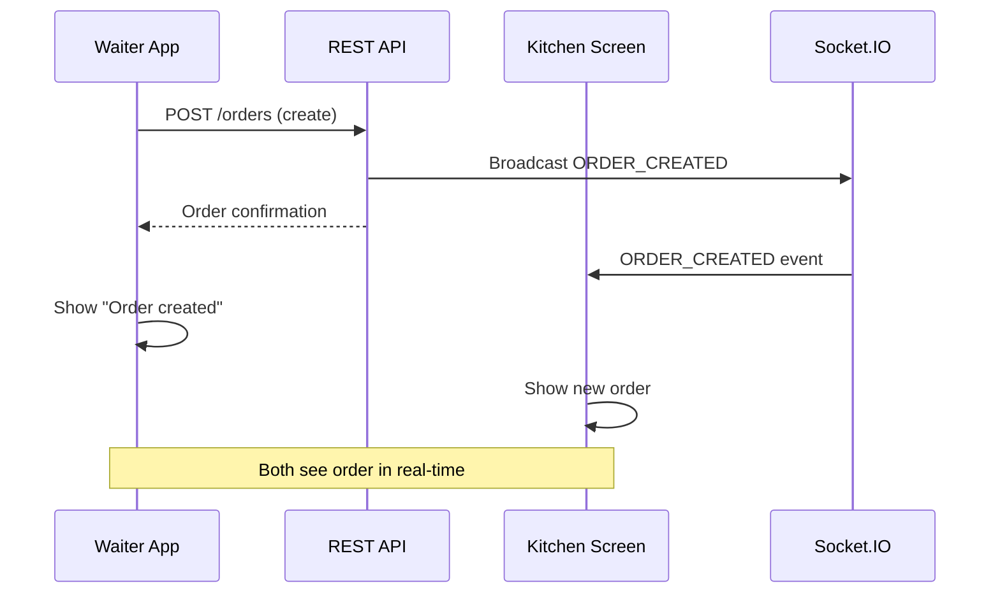
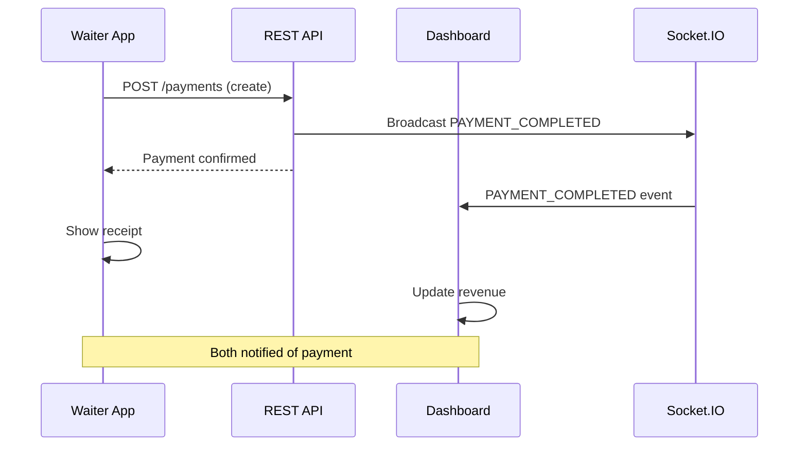

# Waiter App Screen Flow & Navigation

## Application Structure

The Waiter App follows a bottom-tab navigation pattern with nested stack navigators.

```
Waiter App (React Native + Expo)
├── Authentication Stack
│   ├── Splash Screen
│   ├── Login Screen
│   └── Forgot Password
│
└── Main App (After Login)
    ├── Dashboard Tab
    │   ├── Dashboard Home
    │   ├── Running Orders Details
    │   └── Order History
    │
    ├── Tables Tab
    │   ├── Table List
    │   ├── Table Details
    │   └── Create Order
    │
    ├── Orders Tab
    │   ├── Active Orders
    │   ├── Order Details
    │   └── Add Items
    │
    ├── Billing Tab
    │   ├── Pending Payments
    │   ├── Payment Screen
    │   └── Receipt
    │
    └── Profile Tab
        ├── User Profile
        ├── Settings
        └── Logout
```

---

## Screen Details

### 1. Splash Screen

**Purpose**: Initial app load, check authentication state

**UI Elements**:
- App logo/branding
- Loading spinner
- "Connecting to kitchen..." message

**APIs Called**:
- Verify stored token (no API call, local check)

**State Variables**:
- `isLoading: boolean` - Still loading?
- `isSignedIn: boolean` - User authenticated?

**Navigation**:
- If token valid → Dashboard
- If token invalid/expired → Login
- If first time → Login

**Validation**:
- Check token exists
- Check token not expired

---

### 2. Login Screen

**Purpose**: Authenticate user with email/password

**UI Elements**:
- Email input field
- Password input field
- Login button
- Forgot password link
- Loading state (disable button, show spinner)

**APIs Used**:
- `POST /api/v1/auth/login`
  - Body: `{email, password}`
  - Returns: `{token, refreshToken, user}`

**State Variables**:
```typescript
const [email, setEmail] = useState('');
const [password, setPassword] = useState('');
const [isLoading, setIsLoading] = useState(false);
const [error, setError] = useState('');
```

**Validation**:
- Email: valid format (email@domain.com)
- Password: minimum 6 characters
- Display field-level errors

**Error Handling**:
```json
// Invalid credentials
{
  "error": {"message": "Invalid email or password", "code": "INVALID_CREDENTIALS"}
}

// Too many attempts
{
  "error": {"message": "Too many login attempts. Try again in 5 minutes", "code": "RATE_LIMITED"}
}
```

**On Success**:
1. Store token + refreshToken securely
2. Extract user info from response
3. Subscribe to WebSocket
4. Navigate to Dashboard

---

### 3. Dashboard Screen

**Purpose**: Overview of current operations

**UI Elements**:
- Restaurant name
- Current time
- Stats cards:
  - Total orders today
  - Pending orders
  - Tables occupied
  - Revenue today
- Recent orders list (scrollable)
- Action buttons:
  - New Order
  - View Tables
  - View Payments

**APIs Used**:
- `GET /api/v1/tables/with-status` - Get table occupancy
- `GET /api/v1/orders?limit=5&offset=0` - Recent orders
- WebSocket: `ORDER_CREATED`, `ORDER_UPDATED`, `PAYMENT_COMPLETED`

**State Variables**:
```typescript
const [tableCount, setTableCount] = useState(0);
const [occupiedTables, setOccupiedTables] = useState(0);
const [recentOrders, setRecentOrders] = useState([]);
const [totalRevenue, setTotalRevenue] = useState(0);
const [isRefreshing, setIsRefreshing] = useState(false);
```

**Refresh Logic**:
- Pull-to-refresh: reload all data
- WebSocket updates: real-time updates
- Auto-refresh: every 10 seconds (if no WebSocket)

**Real-Time Updates**:
```typescript
socket.on('ORDER_CREATED', (payload) => {
  updateDashboard();
});

socket.on('TABLE_OCCUPIED', (payload) => {
  setOccupiedTables(prev => prev + 1);
});
```

---

### 4. Tables Screen

**Purpose**: View all tables and see which are occupied

**UI Elements**:
- Grid or list of tables
- Each table card shows:
  - Table number
  - Seating capacity
  - Status (occupied/available)
  - Active order ID (if occupied)
- Color coding:
  - Green: Available
  - Red: Occupied
  - Gray: Inactive
- Floating Action Button: "New Order"

**APIs Used**:
- `GET /api/v1/tables/with-status` - All tables with occupancy
- `GET /api/v1/orders/active/by-table/:tableId` - Active order for table

**State Variables**:
```typescript
const [tables, setTables] = useState([]);
const [selectedTable, setSelectedTable] = useState(null);
const [isLoading, setIsLoading] = useState(false);
```

**Navigation**:
- Tap on table → Table Details Screen
- Tap "New Order" → Create Order (with table pre-selected)
- Long-press table → Quick actions (if occupied, show order details)

**Real-Time Updates**:
```typescript
socket.on('TABLE_OCCUPIED', (payload) => {
  updateTableStatus(payload.table_id, 'occupied');
});

socket.on('TABLE_FREED', (payload) => {
  updateTableStatus(payload.table_id, 'available');
});
```

---

### 5. Table Details Screen

**Purpose**: See specific table info and its active order

**UI Elements**:
- Table number (large)
- Seating capacity
- Status badge
- Active order info (if occupied):
  - Order number
  - Order time
  - Items count
  - Total amount
- Buttons:
  - "View Order"
  - "Add Items to Order" (if occupied)
  - "New Order" (if available)

**APIs Used**:
- `GET /api/v1/tables/:id` - Table details
- `GET /api/v1/orders/active/by-table/:tableId` - Active order

**Navigation**:
- "View Order" → Order Details Screen
- "Add Items to Order" → Add Items Screen
- "New Order" → Create Order Screen

---

### 6. Menu Screen

**Purpose**: Browse menu items and add to cart

**UI Elements**:
- Category tabs (Beverages, Appetizers, etc.)
- Menu items list with:
  - Item name
  - Description
  - Price
  - Image (optional)
  - Modifier options (if any)
- Add to Cart button
- Cart badge (item count)

**APIs Used**:
- `GET /api/v1/menus` - Full menu on first load
- `GET /api/v1/menus/items/:id` - Item details with modifiers (on tap)

**State Variables**:
```typescript
const [categories, setCategories] = useState([]);
const [items, setItems] = useState([]);
const [selectedCategory, setSelectedCategory] = useState(0);
const [cart, setCart] = useState([]);
const [isLoading, setIsLoading] = useState(false);
```

**Caching**:
- Cache full menu in Redux/Context for 1 hour
- Load from cache on subsequent opens
- Background refresh after displaying

**Interactions**:
- Tap item → Item Details Popup
  - Show modifiers
  - Select modifiers
  - Choose quantity
  - Add to Cart
- Tap cart badge → Cart Screen

**Error Handling**:
- No internet → Show cached menu
- Menu unavailable → "Menu currently unavailable" message

---

### 7. Cart Screen

**Purpose**: Review and finalize items before creating order

**UI Elements**:
- List of cart items:
  - Item name
  - Quantity
  - Price
  - Modifiers summary
  - Delete button
- Subtotal / Total
- Special instructions text field
- "Create Order" button
- "Continue Shopping" button

**State Variables**:
```typescript
const [cartItems, setCartItems] = useState([]);
const [specialInstructions, setSpecialInstructions] = useState('');
const [selectedTable, setSelectedTable] = useState(null);
```

**Validation**:
- At least 1 item in cart
- Table selected (for DINE_IN orders)
- No required modifiers missing

**Calculate Total**:
```typescript
const total = cartItems.reduce((sum, item) => {
  const itemPrice = item.unit_price + (item.modifiers?.reduce((m, mod) => m + mod.price_adjustment, 0) || 0);
  return sum + (itemPrice * item.quantity);
}, 0);
```

**On "Create Order"**:
- Show loading spinner
- Call API: `POST /api/v1/orders`
- On success:
  - Show "Order created successfully"
  - Clear cart
  - Navigate to Running Orders
- On error:
  - Show error toast
  - Keep cart for retry

---

### 8. Create Order Screen

**Purpose**: Create new order from scratch

**UI Elements**:
- Table selector (dropdown or list)
- Order type selector (DINE_IN, PARCEL, ONLINE)
- Menu browser (same as Menu Screen)
- Cart (inline)
- Special instructions
- Create button

**APIs Used**:
- `GET /api/v1/tables` - Get available tables
- `GET /api/v1/menus` - Browse items
- `POST /api/v1/orders` - Create order

**Form Data**:
```typescript
{
  table_id?: "uuid",
  order_type: "DINE_IN" | "PARCEL" | "ONLINE",
  order_source: "WAITER",
  special_instructions?: "string",
  items: [
    {
      menu_item_id: "uuid",
      quantity: 2,
      special_instructions?: "No onions",
      modifiers?: [{modifier_option_id: "uuid"}]
    }
  ]
}
```

**Validation**:
- If DINE_IN: table required
- At least 1 item required
- Quantities must be > 0

---

### 9. Running Orders Screen

**Purpose**: Monitor active orders

**UI Elements**:
- Tabs: All / Pending / Preparing / Ready
- Orders list with:
  - Order number
  - Table number
  - Status
  - Item count
  - Time elapsed
  - Status badge color
- Each order card is tappable
- Pull-to-refresh

**APIs Used**:
- `GET /api/v1/orders?limit=50` - All orders
- Filter in UI by status
- WebSocket: `ORDER_UPDATED`, `ORDER_READY`

**State Variables**:
```typescript
const [orders, setOrders] = useState([]);
const [selectedTab, setSelectedTab] = useState('all'); // all, pending, preparing, ready
const [isRefreshing, setIsRefreshing] = useState(false);
```

**Real-Time Updates**:
```typescript
socket.on('ORDER_UPDATED', (payload) => {
  setOrders(prev => prev.map(o => 
    o.id === payload.order_id ? {...o, status: payload.status} : o
  ));
});

socket.on('ORDER_READY', (payload) => {
  showNotification(`Order ${payload.order_number} is READY!`);
});
```

**Color Coding**:
- CREATED: Gray
- ACCEPTED: Blue
- PREPARING: Yellow
- READY: Green
- COMPLETED: Gray (archived)

---

### 10. Order Details Screen

**Purpose**: View complete order information

**UI Elements**:
- Order header:
  - Order number
  - Table number
  - Status with badge
  - Created time
- Items list:
  - Item name
  - Quantity
  - Price
  - Modifiers
  - Item status (PENDING/PREPARING/DONE)
- Total amount
- Action buttons:
  - "Add More Items" (if order not completed)
  - "Create Payment" (if not paid)
  - "Cancel Order" (admin only)

**APIs Used**:
- `GET /api/v1/orders/:id` - Order details
- `POST /api/v1/orders/:id/items` - Add items
- `GET /api/v1/payments?order_id=:id` - Check if paid
- WebSocket: `ORDER_UPDATED`

**Real-Time Updates**:
```typescript
socket.on('ORDER_UPDATED', (payload) => {
  if (payload.order_id === orderId) {
    setOrder(payload);
  }
});
```

---

### 11. Billing Screen

**Purpose**: Process payment for order

**UI Elements**:
- Order summary:
  - Order number
  - Items list with prices
  - Subtotal
- Payment method selector:
  - CASH
  - CARD
  - UPI
  - ONLINE
- Amount field (auto-filled with order total)
- Reference number field (for card/UPI)
- Notes field
- "Process Payment" button

**APIs Used**:
- `GET /api/v1/orders/:id` - Get order total
- `POST /api/v1/payments` - Create payment

**Request Body**:
```json
{
  "order_id": "uuid",
  "amount": 450.00,
  "method": "CASH",
  "reference_number": "CARD123456"
}
```

**State Variables**:
```typescript
const [paymentMethod, setPaymentMethod] = useState('CASH');
const [amount, setAmount] = useState(order.total_amount);
const [referenceNumber, setReferenceNumber] = useState('');
const [isProcessing, setIsProcessing] = useState(false);
```

**Validation**:
- Amount > 0
- Amount <= Order total + 10% (allow small overpayment)
- If CARD/UPI: reference number provided

**On Success**:
1. Show "Payment successful"
2. Mark order as completed
3. Free up table
4. Show receipt option
5. Navigate back to dashboard

**On Error**:
- Show error message
- Allow retry

---

### 12. Receipt Screen

**Purpose**: Print/share receipt

**UI Elements**:
- Restaurant name and address
- Order date/time
- Order number
- Table number
- Itemized list with prices
- Subtotal
- Total
- Payment method
- Reference number
- Tip option (if CARD)
- "Print" button
- "Share" button
- "Done" button

**No API Calls**: Receipt is generated from order data

---

### 13. Profile Screen

**Purpose**: User profile and app settings

**UI Elements**:
- User info:
  - Name
  - Email
  - Role (WAITER)
  - Restaurant name
- Settings:
  - Theme (Light/Dark)
  - Notifications toggle
  - Sound toggle
- Action buttons:
  - Change password
  - Logout
  - About app
  - Version info

**APIs Used**:
- `GET /api/v1/auth/me` - Current profile
- `POST /api/v1/auth/logout` - Logout

**On Logout**:
1. Clear stored token
2. Disconnect WebSocket
3. Clear Redux/Context state
4. Navigate to Login

---

## Navigation Flow Diagram



---

## Real-Time Updates & WebSocket Integration

### Order Creation Flow



### Payment Flow



---

## State Management Strategy

### Redux Store Structure (recommended)

```typescript
{
  auth: {
    user: User | null,
    token: string | null,
    isLoading: boolean,
  },
  restaurant: {
    id: string,
    name: string,
    tables: Table[],
  },
  menu: {
    categories: MenuCategory[],
    items: MenuItem[],
    lastUpdated: timestamp,
  },
  orders: {
    all: Order[],
    byId: {[id]: Order},
  },
  cart: {
    items: CartItem[],
    total: number,
  },
  ui: {
    selectedTable: Table | null,
    isLoading: boolean,
    error: string | null,
  }
}
```

### Redux Actions

```typescript
// Auth
dispatch(setUser(user));
dispatch(clearAuth());

// Menu
dispatch(loadMenu(menu));
dispatch(updateMenu(newMenu));

// Orders
dispatch(addOrder(order));
dispatch(updateOrder(order));

// Cart
dispatch(addToCart(item));
dispatch(removeFromCart(itemId));
dispatch(clearCart());
```

---

## Offline Capability

### What works offline:
- ✅ View cached menu
- ✅ View cart
- ✅ Add items to cart
- ✅ View cached orders

### What requires connection:
- ❌ Create order
- ❌ Process payment
- ❌ Real-time updates (WebSocket)
- ❌ Login

---

## Accessibility Considerations

- Large tap targets (min 48x48 pt)
- High contrast text
- Screen reader labels
- Haptic feedback for important actions
- Clear error messages
- Keyboard navigation support
