# Sequence Diagrams - Key Flows

## 1. Login Flow

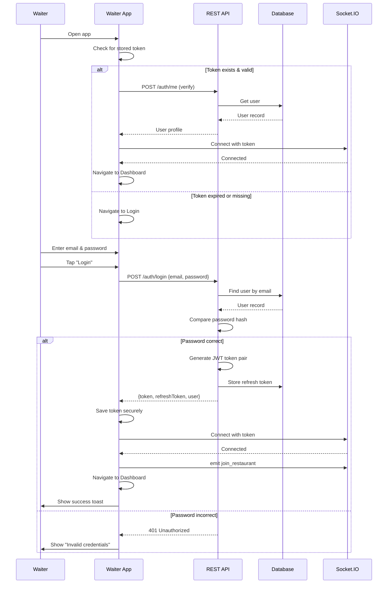
```mermaid
sequenceDiagram
    participant User as Waiter
    participant App as Waiter App
    participant API as REST API
    participant DB as Database
    participant Socket as Socket.IO
    
    User->>App: Open app
    App->>App: Check for stored token
    
    alt Token exists & valid
        App->>API: POST /auth/me (verify)
        API->>DB: Get user
        DB-->>API: User record
        API-->>App: User profile
        App->>Socket: Connect with token
        Socket-->>App: Connected
        App->>App: Navigate to Dashboard
    else Token expired or missing
        App->>App: Navigate to Login
    end
    
    User->>App: Enter email & password
    User->>App: Tap "Login"
    
    App->>API: POST /auth/login {email, password}
    API->>DB: Find user by email
    DB-->>API: User record
    API->>API: Compare password hash
    
    alt Password correct
        API->>API: Generate JWT token pair
        API->>DB: Store refresh token
        API-->>App: {token, refreshToken, user}
        App->>App: Save token securely
        App->>Socket: Connect with token
        Socket-->>App: Connected
        App->>Socket: emit join_restaurant
        App->>App: Navigate to Dashboard
        App->>User: Show success toast
    else Password incorrect
        API-->>App: 401 Unauthorized
        App->>User: Show "Invalid credentials"
    end
```

---

## 2. Create Order Flow

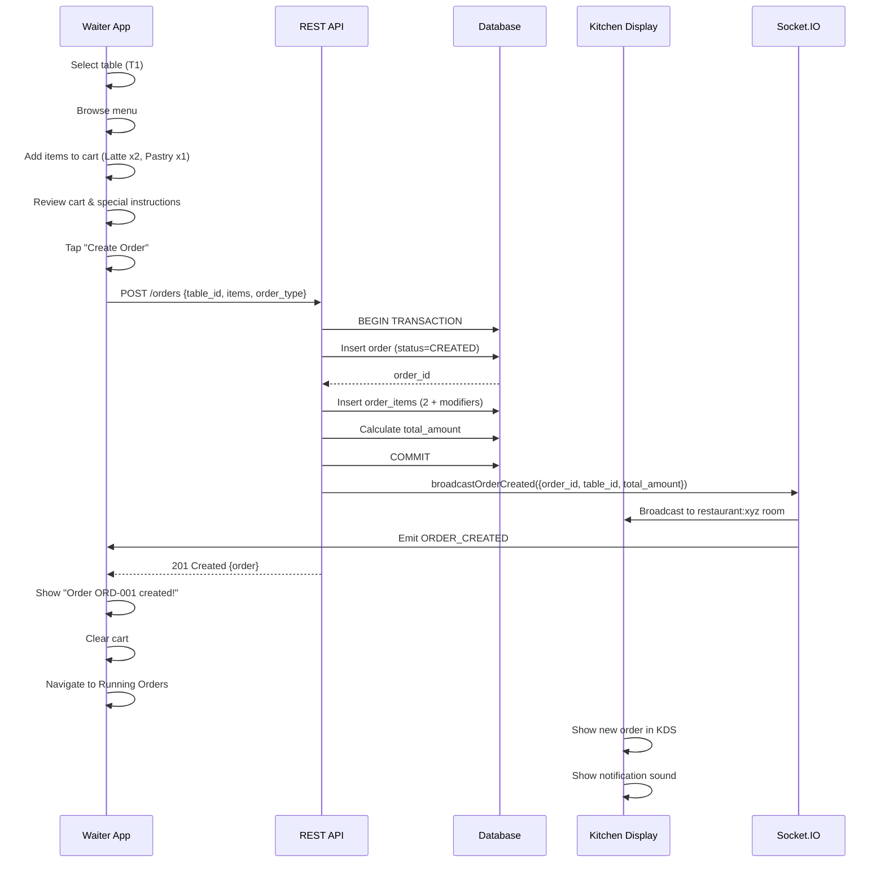
```mermaid
sequenceDiagram
    participant Waiter as Waiter App
    participant API as REST API
    participant DB as Database
    participant Kitchen as Kitchen Display
    participant Socket as Socket.IO
    
    Waiter->>Waiter: Select table (T1)
    Waiter->>Waiter: Browse menu
    Waiter->>Waiter: Add items to cart (Latte x2, Pastry x1)
    Waiter->>Waiter: Review cart & special instructions
    Waiter->>Waiter: Tap "Create Order"
    
    Waiter->>API: POST /orders {table_id, items, order_type}
    
    API->>DB: BEGIN TRANSACTION
    API->>DB: Insert order (status=CREATED)
    DB-->>API: order_id
    API->>DB: Insert order_items (2 + modifiers)
    API->>DB: Calculate total_amount
    API->>DB: COMMIT
    
    API->>Socket: broadcastOrderCreated({order_id, table_id, total_amount})
    
    Socket->>Kitchen: Broadcast to restaurant:xyz room
    Socket->>Waiter: Emit ORDER_CREATED
    
    API-->>Waiter: 201 Created {order}
    
    Waiter->>Waiter: Show "Order ORD-001 created!"
    Waiter->>Waiter: Clear cart
    Waiter->>Waiter: Navigate to Running Orders
    
    Kitchen->>Kitchen: Show new order in KDS
    Kitchen->>Kitchen: Show notification sound
```

---

## 3. Order Update (Kitchen Accepts)

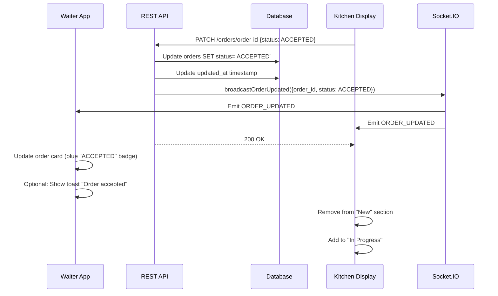
```mermaid
sequenceDiagram
    participant Waiter as Waiter App
    participant API as REST API
    participant DB as Database
    participant KDS as Kitchen Display
    participant Socket as Socket.IO
    
    KDS->>API: PATCH /orders/order-id {status: ACCEPTED}
    
    API->>DB: Update orders SET status='ACCEPTED'
    API->>DB: Update updated_at timestamp
    
    API->>Socket: broadcastOrderUpdated({order_id, status: ACCEPTED})
    
    Socket->>Waiter: Emit ORDER_UPDATED
    Socket->>KDS: Emit ORDER_UPDATED
    
    API-->>KDS: 200 OK
    
    Waiter->>Waiter: Update order card (blue "ACCEPTED" badge)
    Waiter->>Waiter: Optional: Show toast "Order accepted"
    
    KDS->>KDS: Remove from "New" section
    KDS->>KDS: Add to "In Progress"
```

---

## 4. Order Item Status Update (Kitchen Cooks)

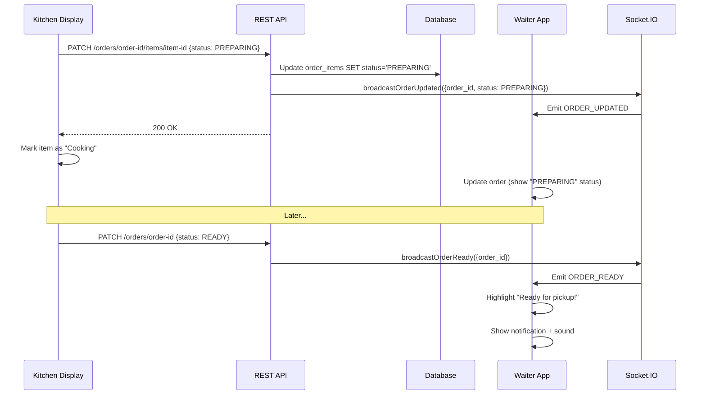
```mermaid
sequenceDiagram
    participant KDS as Kitchen Display
    participant API as REST API
    participant DB as Database
    participant Waiter as Waiter App
    participant Socket as Socket.IO
    
    KDS->>API: PATCH /orders/order-id/items/item-id {status: PREPARING}
    
    API->>DB: Update order_items SET status='PREPARING'
    
    API->>Socket: broadcastOrderUpdated({order_id, status: PREPARING})
    
    Socket->>Waiter: Emit ORDER_UPDATED
    
    API-->>KDS: 200 OK
    
    KDS->>KDS: Mark item as "Cooking"
    
    Waiter->>Waiter: Update order (show "PREPARING" status)
    
    Note over KDS,Waiter: Later...
    
    KDS->>API: PATCH /orders/order-id {status: READY}
    API->>Socket: broadcastOrderReady({order_id})
    Socket->>Waiter: Emit ORDER_READY
    
    Waiter->>Waiter: Highlight "Ready for pickup!"
    Waiter->>Waiter: Show notification + sound
```

---

## 5. Payment Processing

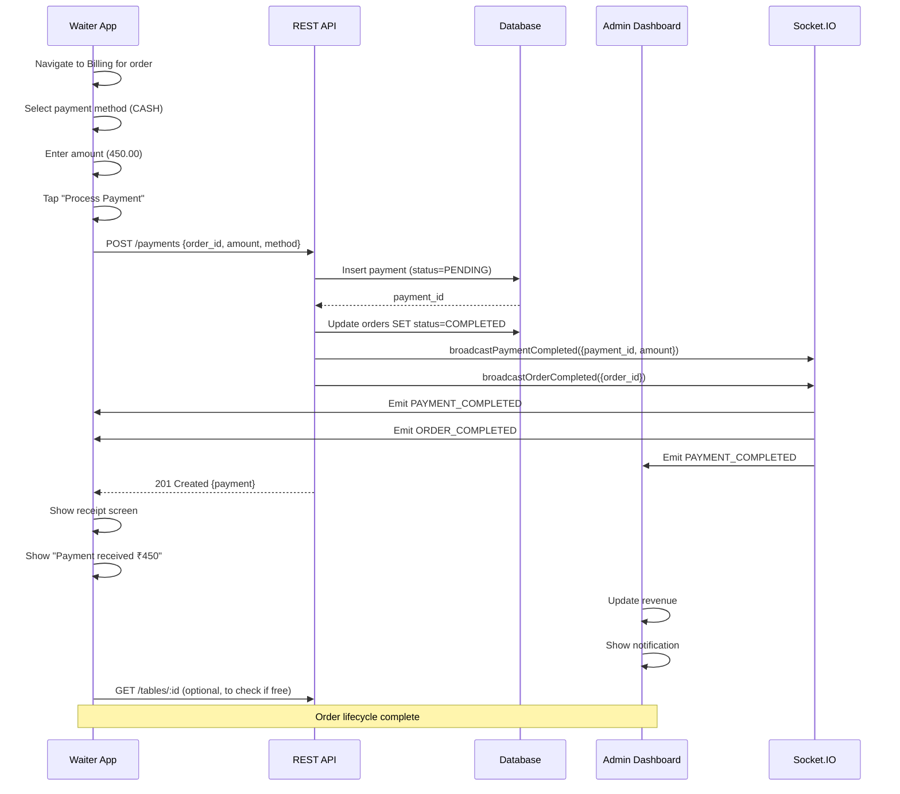
```mermaid
sequenceDiagram
    participant Waiter as Waiter App
    participant API as REST API
    participant DB as Database
    participant Dashboard as Admin Dashboard
    participant Socket as Socket.IO
    
    Waiter->>Waiter: Navigate to Billing for order
    Waiter->>Waiter: Select payment method (CASH)
    Waiter->>Waiter: Enter amount (450.00)
    Waiter->>Waiter: Tap "Process Payment"
    
    Waiter->>API: POST /payments {order_id, amount, method}
    
    API->>DB: Insert payment (status=PENDING)
    DB-->>API: payment_id
    
    API->>DB: Update orders SET status=COMPLETED
    
    API->>Socket: broadcastPaymentCompleted({payment_id, amount})
    API->>Socket: broadcastOrderCompleted({order_id})
    
    Socket->>Waiter: Emit PAYMENT_COMPLETED
    Socket->>Waiter: Emit ORDER_COMPLETED
    Socket->>Dashboard: Emit PAYMENT_COMPLETED
    
    API-->>Waiter: 201 Created {payment}
    
    Waiter->>Waiter: Show receipt screen
    Waiter->>Waiter: Show "Payment received ₹450"
    
    Dashboard->>Dashboard: Update revenue
    Dashboard->>Dashboard: Show notification
    
    Waiter->>API: GET /tables/:id (optional, to check if free)
    
    Note over Waiter,Dashboard: Order lifecycle complete
```

---

## 6. Real-Time Notification Example

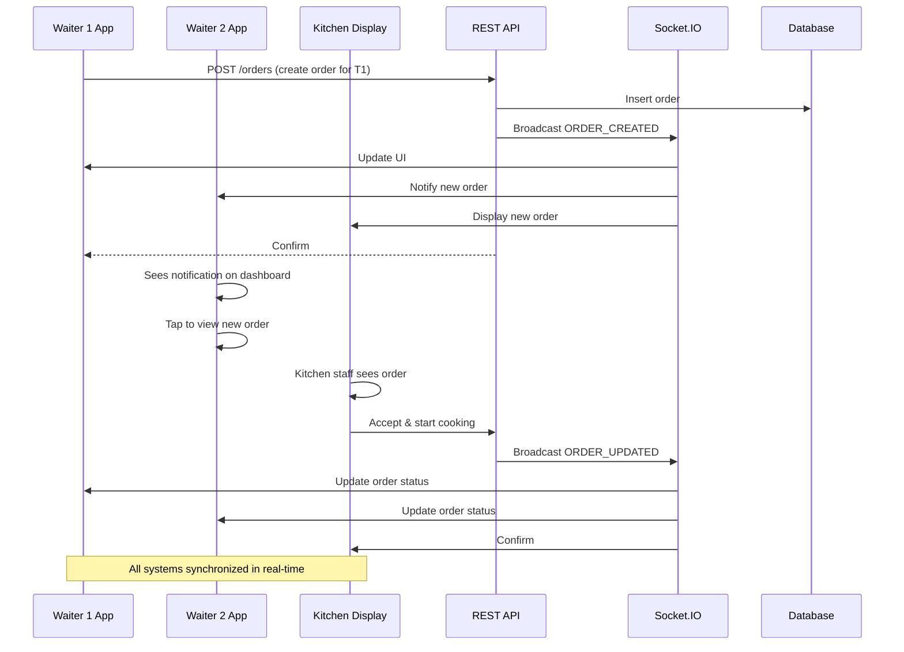
```mermaid
sequenceDiagram
    participant Waiter1 as Waiter 1 App
    participant Waiter2 as Waiter 2 App
    participant KDS as Kitchen Display
    participant API as REST API
    participant Socket as Socket.IO
    participant DB as Database
    
    Waiter1->>API: POST /orders (create order for T1)
    API->>DB: Insert order
    API->>Socket: Broadcast ORDER_CREATED
    
    Socket->>Waiter1: Update UI
    Socket->>Waiter2: Notify new order
    Socket->>KDS: Display new order
    
    API-->>Waiter1: Confirm
    
    Waiter2->>Waiter2: Sees notification on dashboard
    Waiter2->>Waiter2: Tap to view new order
    
    KDS->>KDS: Kitchen staff sees order
    KDS->>API: Accept & start cooking
    
    API->>Socket: Broadcast ORDER_UPDATED
    
    Socket->>Waiter1: Update order status
    Socket->>Waiter2: Update order status
    Socket->>KDS: Confirm
    
    Note over Waiter1,KDS: All systems synchronized in real-time
```

---

## 7. Add Items to Existing Order

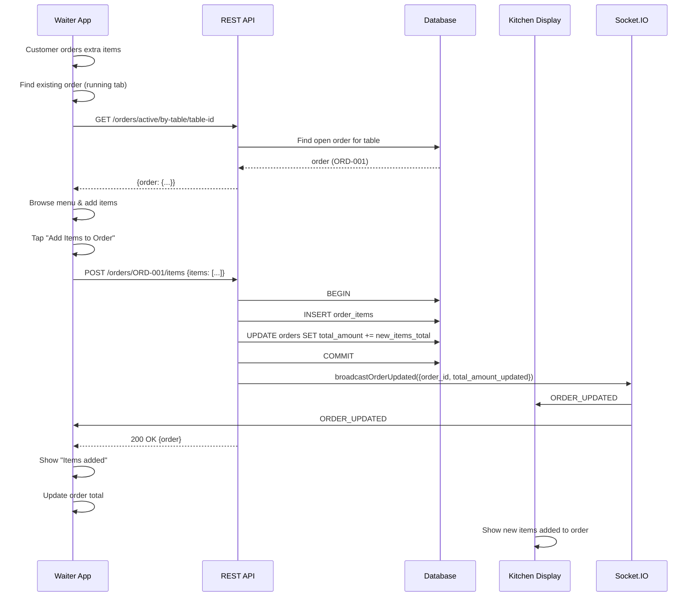
```mermaid
sequenceDiagram
    participant Waiter as Waiter App
    participant API as REST API
    participant DB as Database
    participant Kitchen as Kitchen Display
    participant Socket as Socket.IO
    
    Waiter->>Waiter: Customer orders extra items
    Waiter->>Waiter: Find existing order (running tab)
    Waiter->>API: GET /orders/active/by-table/table-id
    API->>DB: Find open order for table
    DB-->>API: order (ORD-001)
    API-->>Waiter: {order: {...}}
    
    Waiter->>Waiter: Browse menu & add items
    Waiter->>Waiter: Tap "Add Items to Order"
    
    Waiter->>API: POST /orders/ORD-001/items {items: [...]}
    
    API->>DB: BEGIN
    API->>DB: INSERT order_items
    API->>DB: UPDATE orders SET total_amount += new_items_total
    API->>DB: COMMIT
    
    API->>Socket: broadcastOrderUpdated({order_id, total_amount_updated})
    
    Socket->>Kitchen: ORDER_UPDATED
    Socket->>Waiter: ORDER_UPDATED
    
    API-->>Waiter: 200 OK {order}
    
    Waiter->>Waiter: Show "Items added"
    Waiter->>Waiter: Update order total
    
    Kitchen->>Kitchen: Show new items added to order
```

---

## 8. Token Refresh

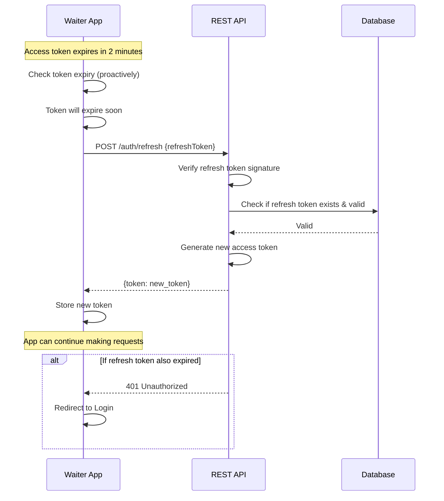
```mermaid
sequenceDiagram
    participant App as Waiter App
    participant API as REST API
    participant DB as Database
    
    Note over App: Access token expires in 2 minutes
    
    App->>App: Check token expiry (proactively)
    App->>App: Token will expire soon
    
    App->>API: POST /auth/refresh {refreshToken}
    
    API->>API: Verify refresh token signature
    API->>DB: Check if refresh token exists & valid
    DB-->>API: Valid
    
    API->>API: Generate new access token
    API-->>App: {token: new_token}
    
    App->>App: Store new token
    
    Note over App: App can continue making requests
    
    alt If refresh token also expired
        API-->>App: 401 Unauthorized
        App->>App: Redirect to Login
    end
```

---

## 9. Table Status Change

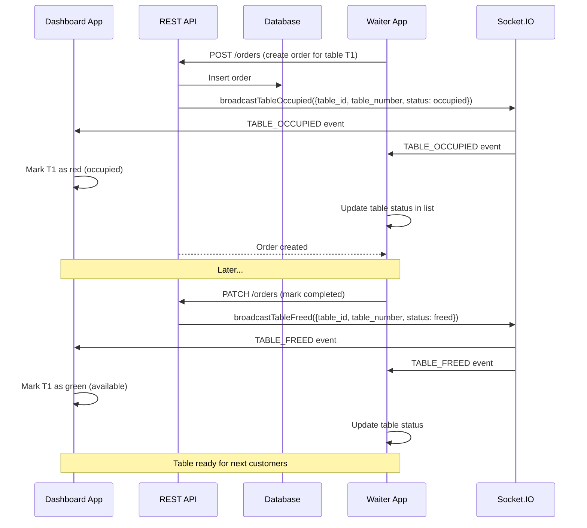
```mermaid
sequenceDiagram
    participant Dashboard as Dashboard App
    participant API as REST API
    participant DB as Database
    participant Waiter as Waiter App
    participant Socket as Socket.IO
    
    Waiter->>API: POST /orders (create order for table T1)
    
    API->>DB: Insert order
    API->>Socket: broadcastTableOccupied({table_id, table_number, status: occupied})
    
    Socket->>Dashboard: TABLE_OCCUPIED event
    Socket->>Waiter: TABLE_OCCUPIED event
    
    Dashboard->>Dashboard: Mark T1 as red (occupied)
    Waiter->>Waiter: Update table status in list
    
    API-->>Waiter: Order created
    
    Note over Dashboard,Waiter: Later...
    
    Waiter->>API: PATCH /orders (mark completed)
    
    API->>Socket: broadcastTableFreed({table_id, table_number, status: freed})
    
    Socket->>Dashboard: TABLE_FREED event
    Socket->>Waiter: TABLE_FREED event
    
    Dashboard->>Dashboard: Mark T1 as green (available)
    Waiter->>Waiter: Update table status
    
    Note over Dashboard,Waiter: Table ready for next customers
```

---

## 10. Disconnection & Reconnection

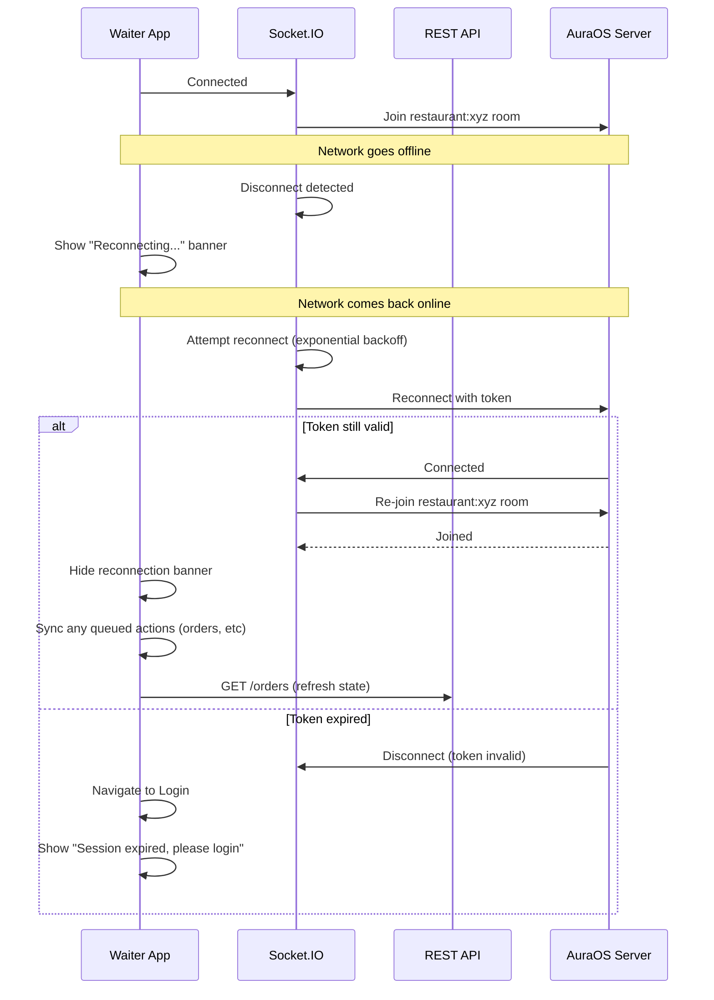
```mermaid
sequenceDiagram
    participant App as Waiter App
    participant Socket as Socket.IO
    participant API as REST API
    participant Server as AuraOS Server
    
    App->>Socket: Connected
    Socket->>Server: Join restaurant:xyz room
    
    Note over App,Server: Network goes offline
    
    Socket->>Socket: Disconnect detected
    App->>App: Show "Reconnecting..." banner
    
    Note over App,Server: Network comes back online
    
    Socket->>Socket: Attempt reconnect (exponential backoff)
    Socket->>Server: Reconnect with token
    
    alt Token still valid
        Server->>Socket: Connected
        Socket->>Server: Re-join restaurant:xyz room
        Server-->>Socket: Joined
        App->>App: Hide reconnection banner
        App->>App: Sync any queued actions (orders, etc)
        App->>API: GET /orders (refresh state)
    else Token expired
        Server->>Socket: Disconnect (token invalid)
        App->>App: Navigate to Login
        App->>App: Show "Session expired, please login"
    end
```

---

## 11. Complete Order Lifecycle

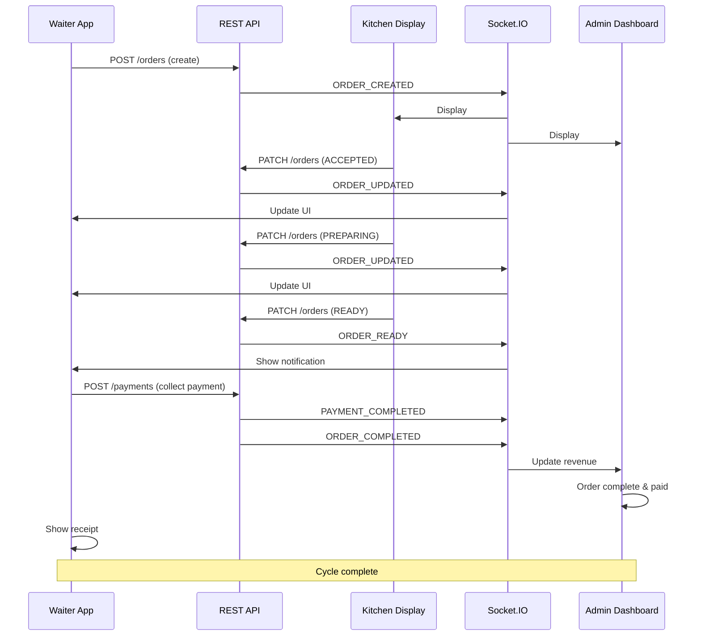
```mermaid
sequenceDiagram
    participant Waiter as Waiter App
    participant API as REST API
    participant Kitchen as Kitchen Display
    participant Socket as Socket.IO
    participant Dashboard as Admin Dashboard
    
    Waiter->>API: POST /orders (create)
    API->>Socket: ORDER_CREATED
    Socket->>Kitchen: Display
    Socket->>Dashboard: Display
    
    Kitchen->>API: PATCH /orders (ACCEPTED)
    API->>Socket: ORDER_UPDATED
    Socket->>Waiter: Update UI
    
    Kitchen->>API: PATCH /orders (PREPARING)
    API->>Socket: ORDER_UPDATED
    Socket->>Waiter: Update UI
    
    Kitchen->>API: PATCH /orders (READY)
    API->>Socket: ORDER_READY
    Socket->>Waiter: Show notification
    
    Waiter->>API: POST /payments (collect payment)
    API->>Socket: PAYMENT_COMPLETED
    API->>Socket: ORDER_COMPLETED
    Socket->>Dashboard: Update revenue
    
    Dashboard->>Dashboard: Order complete & paid
    Waiter->>Waiter: Show receipt
    
    Note over Waiter,Dashboard: Cycle complete
```

---

## Error Scenarios

### Invalid Token Flow

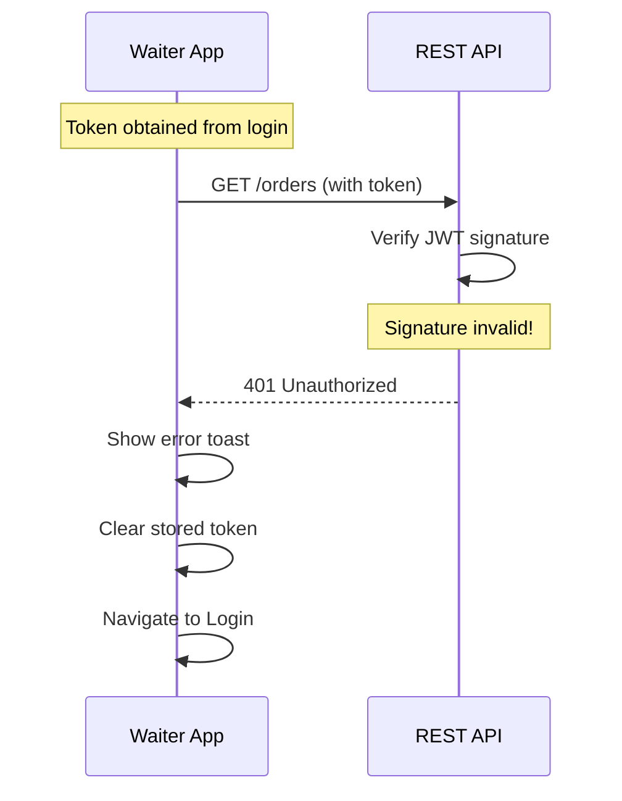
```mermaid
sequenceDiagram
    participant App as Waiter App
    participant API as REST API
    
    Note over App: Token obtained from login
    
    App->>API: GET /orders (with token)
    API->>API: Verify JWT signature
    Note over API: Signature invalid!
    API-->>App: 401 Unauthorized
    
    App->>App: Show error toast
    App->>App: Clear stored token
    App->>App: Navigate to Login
```

### Rate Limited Flow

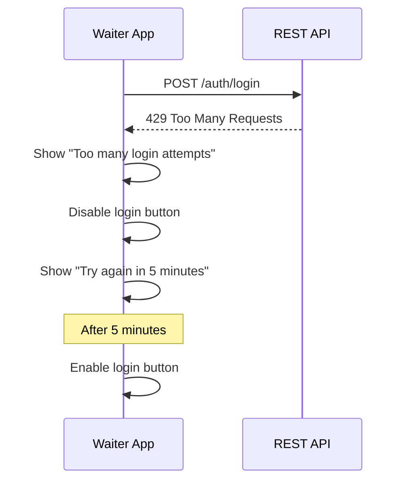
```mermaid
sequenceDiagram
    participant App as Waiter App
    participant API as REST API
    
    App->>API: POST /auth/login
    API-->>App: 429 Too Many Requests
    
    App->>App: Show "Too many login attempts"
    App->>App: Disable login button
    App->>App: Show "Try again in 5 minutes"
    
    Note over App: After 5 minutes
    App->>App: Enable login button
```

### Network Timeout

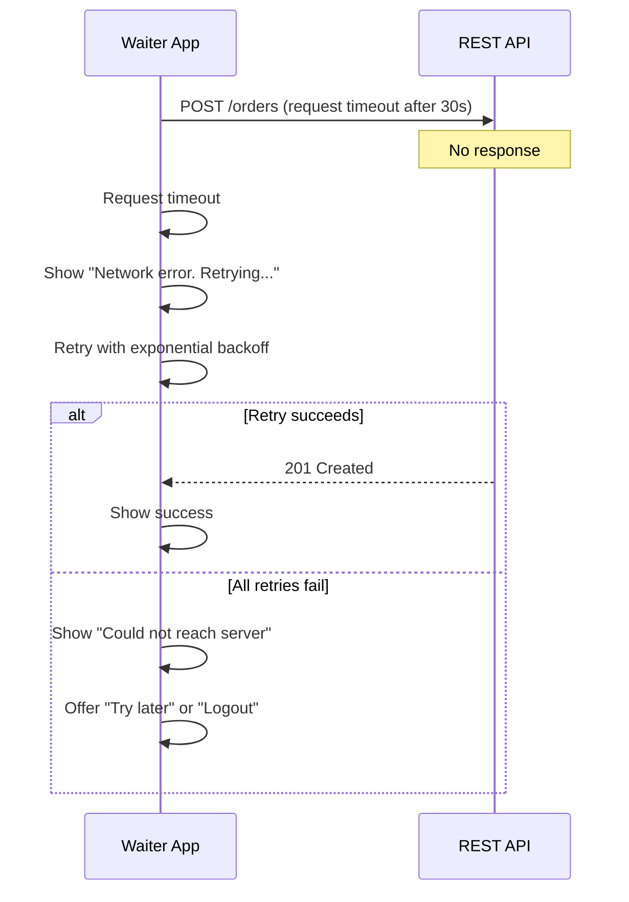
```mermaid
sequenceDiagram
    participant App as Waiter App
    participant API as REST API
    
    App->>API: POST /orders (request timeout after 30s)
    Note over API: No response
    
    App->>App: Request timeout
    App->>App: Show "Network error. Retrying..."
    App->>App: Retry with exponential backoff
    
    alt Retry succeeds
        API-->>App: 201 Created
        App->>App: Show success
    else All retries fail
        App->>App: Show "Could not reach server"
        App->>App: Offer "Try later" or "Logout"
    end
```

---

## Summary

These diagrams cover:
1. **Authentication**: Login, token refresh
2. **Order Operations**: Create, update, add items
3. **Real-Time**: Kitchen updates, notifications
4. **Payments**: Collection and confirmation
5. **Connectivity**: Reconnection, error handling

All flows maintain multi-tenancy isolation and ensure data consistency through database transactions and event broadcasting.
