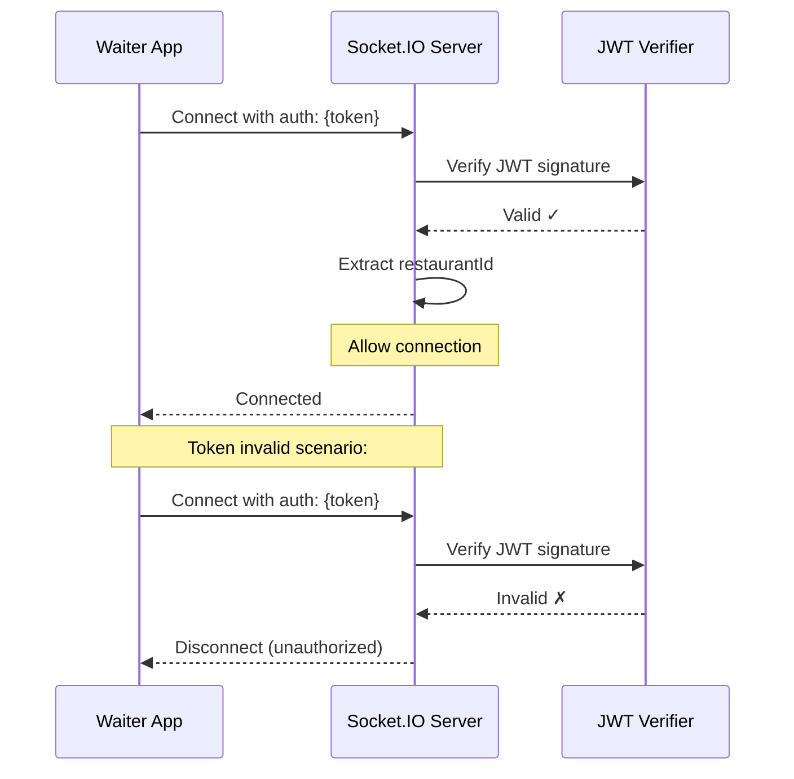

# Socket.IO Real-Time Events Guide

## Overview

Socket.IO provides real-time, bidirectional communication between the waiter app and AuraOS backend. This enables instant notifications for order updates, kitchen status changes, and payment confirmations.

---

## Connection Flow

### Step 1: Connect to WebSocket

```javascript
import { io } from 'socket.io-client';

const socket = io('http://your-backend-url', {
  auth: {
    token: accessToken, // JWT from login
  },
  transports: ['websocket', 'polling'],
  reconnection: true,
  reconnectionDelay: 1000,
  reconnectionDelayMax: 5000,
  reconnectionAttempts: Infinity,
});
```

### Step 2: Wait for Connection Confirmation

```javascript
socket.on('connect', () => {
  console.log('Socket connected:', socket.id);
  
  // Join restaurant room to receive broadcasts
  socket.emit('join_restaurant', {
    restaurantId: 'your-restaurant-uuid',
  });
});
```

### Step 3: Handle Connection Errors

```javascript
socket.on('connect_error', (error) => {
  console.error('Connection error:', error);
  // Retry with exponential backoff (socket.io handles this)
});

socket.on('disconnect', (reason) => {
  console.log('Disconnected:', reason);
  // Socket.io will automatically attempt to reconnect
});
```

---

## Authentication

### JWT Token Verification

The server verifies the JWT token during connection handshake:



### Handling Token Expiry

When WebSocket token expires (backend will disconnect you):

```javascript
socket.on('disconnect', (reason) => {
  if (reason === 'io server disconnect') {
    // Server explicitly disconnected (usually due to token expiry)
    // Refresh token and reconnect
    const newToken = await refreshAccessToken();
    socket.auth.token = newToken;
    socket.connect();
  }
});
```

---

## Rooms

### Restaurant Room

All staff in a restaurant join a room to receive broadcasts:

```javascript
// Join on connection
socket.emit('join_restaurant', {
  restaurantId: restaurantId, // from JWT payload
});

// Automatically leaves on disconnect
socket.on('disconnect', () => {
  // Socket.io auto-leaves all rooms
});
```

**Room Name Pattern**: `restaurant:{restaurantId}`

**Members**: All authenticated users (WAITER, KITCHEN, ADMIN, RECEPTION) from this restaurant

**Broadcasts Received**: All order, payment, inventory, and table events

### Order Tracking Room (Public)

Customers can track their order using the order number:

```javascript
// Customer connects without JWT
const publicSocket = io('http://your-backend-url', {
  // No auth token
  transports: ['websocket', 'polling'],
});

publicSocket.on('connect', () => {
  // Listen for a specific order
  publicSocket.emit('track_order', {
    orderNumber: 'ORD-001',
  });
});

publicSocket.on('ORDER_UPDATED', (payload) => {
  console.log('Order status:', payload.status);
});

publicSocket.disconnect();
```

**Room Name Pattern**: `order:{orderNumber}`

**Members**: Any connected client tracking this order (no authentication required)

**Broadcasts Received**: Order status updates only (no sensitive data)

---

## Emit Events (Client → Server)

### join_restaurant

Subscribe to a restaurant's broadcasts.

**Payload:**
```javascript
{
  restaurantId: "restaurant-uuid"
}
```

**Response**: No explicit response; socket joins the room

**Example:**
```javascript
socket.emit('join_restaurant', {
  restaurantId: 'a1b2c3d4-e5f6-4789-0123-456789abcdef',
});
```

---

### track_order

Subscribe to public order tracking (no authentication required).

**Payload:**
```javascript
{
  orderNumber: "ORD-001"
}
```

**Response**: No explicit response; socket joins the room

**Example:**
```javascript
socket.emit('track_order', {
  orderNumber: 'ORD-001',
});
```

---

## Listen Events (Server → Client)

### ORDER_CREATED

Fired when a new order is created (e.g., by a waiter).

**Payload:**
```json
{
  "order_id": "order-uuid",
  "restaurant_id": "restaurant-uuid",
  "status": "CREATED",
  "total_amount": 450.00,
  "table_id": "table-uuid",
  "order_number": "ORD-001"
}
```

**Broadcast To**: `restaurant:{restaurantId}` room (all staff)

**Example:**
```javascript
socket.on('ORDER_CREATED', (payload) => {
  console.log(`Order ${payload.order_number} created with amount ${payload.total_amount}`);
  // Update UI: show new order in list
  // Show notification to kitchen staff
});
```

---

### ORDER_UPDATED

Fired when order status changes or items are added.

**Payload:**
```json
{
  "order_id": "order-uuid",
  "restaurant_id": "restaurant-uuid",
  "status": "PREPARING",
  "total_amount": 450.00,
  "table_id": "table-uuid",
  "order_number": "ORD-001"
}
```

**Broadcast To**: 
- `restaurant:{restaurantId}` room (all staff)
- `order:{orderNumber}` room (if order_number provided - public customers)

**Example:**
```javascript
socket.on('ORDER_UPDATED', (payload) => {
  console.log(`Order ${payload.order_number} now ${payload.status}`);
  
  // Update order in list
  updateOrderInUI(payload.order_id, payload.status);
  
  // Customer tracking: show "Preparing" status
  showCustomerNotification(`Your order is ${payload.status}`);
});
```

---

### ORDER_READY

Fired when all items in an order are prepared and ready.

**Payload:**
```json
{
  "order_id": "order-uuid",
  "restaurant_id": "restaurant-uuid",
  "status": "READY",
  "total_amount": 450.00,
  "table_id": "table-uuid",
  "order_number": "ORD-001"
}
```

**Broadcast To**: 
- `restaurant:{restaurantId}` room (all staff)
- `order:{orderNumber}` room (customers)

**Example:**
```javascript
socket.on('ORDER_READY', (payload) => {
  showNotification(`Order ${payload.order_number} is ready! Pick up from table ${tableNumber}`);
  
  // Mark visually in running orders list
  highlightReadyOrder(payload.order_id);
});
```

---

### ORDER_COMPLETED

Fired when order is completed and served.

**Payload:**
```json
{
  "order_id": "order-uuid",
  "restaurant_id": "restaurant-uuid",
  "status": "COMPLETED",
  "total_amount": 450.00,
  "table_id": "table-uuid",
  "order_number": "ORD-001"
}
```

**Broadcast To**: 
- `restaurant:{restaurantId}` room (all staff)
- `order:{orderNumber}` room (customers)

**Example:**
```javascript
socket.on('ORDER_COMPLETED', (payload) => {
  console.log(`Order ${payload.order_number} completed`);
  removeFromRunningOrders(payload.order_id);
});
```

---

### ORDER_CANCELLED

Fired when order is cancelled.

**Payload:**
```json
{
  "order_id": "order-uuid",
  "restaurant_id": "restaurant-uuid",
  "status": "CANCELLED",
  "total_amount": 450.00,
  "table_id": "table-uuid",
  "order_number": "ORD-001"
}
```

**Broadcast To**: 
- `restaurant:{restaurantId}` room (all staff)
- `order:{orderNumber}` room (customers)

**Example:**
```javascript
socket.on('ORDER_CANCELLED', (payload) => {
  showAlert(`Order ${payload.order_number} has been cancelled`);
  removeFromRunningOrders(payload.order_id);
  freseUpTable(payload.table_id);
});
```

---

### ORDER_DELAYED

Fired when an order exceeds the restaurant's delay threshold (background job).

**Payload:**
```json
{
  "order_id": "order-uuid",
  "restaurant_id": "restaurant-uuid",
  "order_number": "ORD-001",
  "status": "PREPARING",
  "minutes_elapsed": 25,
  "threshold_minutes": 15,
  "table_number": "T1"
}
```

**Broadcast To**: `restaurant:{restaurantId}` room (all staff)

**Example:**
```javascript
socket.on('ORDER_DELAYED', (payload) => {
  showAlert(`⏰ Order ${payload.order_number} at ${payload.table_number} is delayed!`);
  console.log(`Expected: ${payload.threshold_minutes}m, Actual: ${payload.minutes_elapsed}m`);
  
  // Notify kitchen and manager
  notifyManagement(`Order ${payload.order_number} exceeds SLA`);
});
```

---

### PAYMENT_CREATED

Fired when a payment is created for an order.

**Payload:**
```json
{
  "payment_id": "payment-uuid",
  "restaurant_id": "restaurant-uuid",
  "order_id": "order-uuid",
  "status": "PENDING",
  "amount": 450.00
}
```

**Broadcast To**: `restaurant:{restaurantId}` room

**Example:**
```javascript
socket.on('PAYMENT_CREATED', (payload) => {
  console.log(`Payment of ${payload.amount} initiated for order`);
  updatePaymentUI(payload.payment_id, payload.status);
});
```

---

### PAYMENT_UPDATED

Fired when payment status changes (e.g., PENDING → PAID).

**Payload:**
```json
{
  "payment_id": "payment-uuid",
  "restaurant_id": "restaurant-uuid",
  "order_id": "order-uuid",
  "status": "PAID",
  "amount": 450.00
}
```

**Broadcast To**: `restaurant:{restaurantId}` room

**Example:**
```javascript
socket.on('PAYMENT_UPDATED', (payload) => {
  console.log(`Payment status: ${payload.status}`);
  updatePaymentUI(payload.payment_id, payload.status);
});
```

---

### PAYMENT_COMPLETED

Fired when payment is successfully completed.

**Payload:**
```json
{
  "payment_id": "payment-uuid",
  "restaurant_id": "restaurant-uuid",
  "order_id": "order-uuid",
  "status": "PAID",
  "amount": 450.00
}
```

**Broadcast To**: `restaurant:{restaurantId}` room

**Example:**
```javascript
socket.on('PAYMENT_COMPLETED', (payload) => {
  showSuccessNotification(`Payment received! Amount: ₹${payload.amount}`);
  completeOrderFlow(payload.order_id);
});
```

---

### TABLE_OCCUPIED

Fired when a table receives an active order.

**Payload:**
```json
{
  "table_id": "table-uuid",
  "restaurant_id": "restaurant-uuid",
  "table_number": "T1",
  "status": "occupied"
}
```

**Broadcast To**: `restaurant:{restaurantId}` room

**Example:**
```javascript
socket.on('TABLE_OCCUPIED', (payload) => {
  updateTableStatus(payload.table_id, 'occupied');
  console.log(`Table ${payload.table_number} is now occupied`);
});
```

---

### TABLE_FREED

Fired when a table's last order is completed/cancelled.

**Payload:**
```json
{
  "table_id": "table-uuid",
  "restaurant_id": "restaurant-uuid",
  "table_number": "T1",
  "status": "freed"
}
```

**Broadcast To**: `restaurant:{restaurantId}` room

**Example:**
```javascript
socket.on('TABLE_FREED', (payload) => {
  updateTableStatus(payload.table_id, 'available');
  console.log(`Table ${payload.table_number} is now available`);
  
  // Show clear table option to staff
  showClearTableButton(payload.table_id);
});
```

---

### INVENTORY_LOW_STOCK

Fired when inventory falls below reorder level.

**Payload:**
```json
{
  "inventory_item_id": "inventory-uuid",
  "restaurant_id": "restaurant-uuid",
  "menu_item_id": "menu-item-uuid",
  "current_stock": 5,
  "reorder_level": 10
}
```

**Broadcast To**: `restaurant:{restaurantId}` room

**Example:**
```javascript
socket.on('INVENTORY_LOW_STOCK', (payload) => {
  showAlert(`⚠️ Low stock: Menu item (ID: ${payload.menu_item_id}) - only ${payload.current_stock} left`);
  
  // Optionally disable item in menu
  disableMenuItem(payload.menu_item_id);
});
```

---

### INVENTORY_UPDATED

Fired when inventory is updated.

**Payload:**
```json
{
  "inventory_item_id": "inventory-uuid",
  "restaurant_id": "restaurant-uuid",
  "menu_item_id": "menu-item-uuid",
  "current_stock": 50,
  "reorder_level": 10
}
```

**Broadcast To**: `restaurant:{restaurantId}` room

**Example:**
```javascript
socket.on('INVENTORY_UPDATED', (payload) => {
  console.log(`Stock updated for item: ${payload.current_stock}`);
  
  // Re-enable item if stock now above reorder level
  if (payload.current_stock > payload.reorder_level) {
    enableMenuItem(payload.menu_item_id);
  }
});
```

---

## Complete Client Example

### React Native + TypeScript Implementation

```typescript
import { useEffect, useState } from 'react';
import { io, Socket } from 'socket.io-client';

interface WaiterSocketContext {
  socket: Socket | null;
  isConnected: boolean;
  orders: Order[];
  notifications: string[];
}

export const useWaiterSocket = (
  apiUrl: string,
  token: string,
  restaurantId: string
): WaiterSocketContext => {
  const [socket, setSocket] = useState<Socket | null>(null);
  const [isConnected, setIsConnected] = useState(false);
  const [orders, setOrders] = useState<Order[]>([]);
  const [notifications, setNotifications] = useState<string[]>([]);

  useEffect(() => {
    if (!token || !restaurantId) return;

    const newSocket = io(apiUrl, {
      auth: { token },
      transports: ['websocket', 'polling'],
      reconnection: true,
      reconnectionDelay: 1000,
    });

    // Connection handlers
    newSocket.on('connect', () => {
      console.log('Socket connected');
      setIsConnected(true);
      
      newSocket.emit('join_restaurant', { restaurantId });
    });

    newSocket.on('disconnect', () => {
      setIsConnected(false);
    });

    // Order event handlers
    newSocket.on('ORDER_CREATED', (payload: OrderPayload) => {
      setOrders((prev) => [...prev, payload]);
      setNotifications((prev) => [
        ...prev,
        `Order ${payload.order_number} created`,
      ]);
    });

    newSocket.on('ORDER_UPDATED', (payload: OrderPayload) => {
      setOrders((prev) =>
        prev.map((o) => (o.order_id === payload.order_id ? payload : o))
      );
    });

    newSocket.on('ORDER_READY', (payload: OrderPayload) => {
      setNotifications((prev) => [
        ...prev,
        `Order ${payload.order_number} is READY!`,
      ]);
    });

    newSocket.on('PAYMENT_COMPLETED', (payload: PaymentPayload) => {
      setNotifications((prev) => [
        ...prev,
        `Payment of ₹${payload.amount} received`,
      ]);
    });

    setSocket(newSocket);

    return () => {
      newSocket.disconnect();
    };
  }, [apiUrl, token, restaurantId]);

  return { socket, isConnected, orders, notifications };
};
```

---

## Error Handling

### Common Socket Errors

| Error | Cause | Solution |
|-------|-------|----------|
| `auth_error` | Invalid JWT token | Refresh token and reconnect |
| `connect_error` | Network issue | Socket.io auto-retries |
| `disconnect` | Server closed connection | Check token expiry, log out if needed |
| `room_error` | Failed to join room | Ensure restaurantId is valid |

### Reconnection Strategy

Socket.io automatically handles reconnection with exponential backoff:

```javascript
const socket = io(apiUrl, {
  reconnection: true,
  reconnectionDelay: 1000,           // Start at 1s
  reconnectionDelayMax: 5000,         // Max 5s
  reconnectionAttempts: Infinity,     // Keep trying forever
});

socket.on('reconnect', () => {
  console.log('Reconnected to server');
  // Re-join rooms if needed
  socket.emit('join_restaurant', { restaurantId });
});

socket.on('reconnect_error', (error) => {
  console.error('Reconnection failed:', error);
  // Show user that connection is unstable
});
```

---

## Performance Optimization

### Event Batching

For high-volume events (many orders updating), the waiter app should batch UI updates:

```javascript
let updateQueue: Order[] = [];
let updateTimeout: NodeJS.Timeout | null = null;

socket.on('ORDER_UPDATED', (payload: OrderPayload) => {
  updateQueue.push(payload);
  
  if (updateTimeout) clearTimeout(updateTimeout);
  
  updateTimeout = setTimeout(() => {
    // Process all updates at once
    updateOrdersInUI(updateQueue);
    updateQueue = [];
  }, 100); // 100ms batch window
});
```

### Memory Management

Remove old notifications after display:

```javascript
const [notifications, setNotifications] = useState<string[]>([]);

const addNotification = (message: string) => {
  setNotifications((prev) => [...prev, message]);
  
  // Auto-remove after 3 seconds
  setTimeout(() => {
    setNotifications((prev) => prev.slice(1));
  }, 3000);
};
```

---

## Testing Socket Events

### Using curl + wscat

```bash
# Install wscat
npm install -g wscat

# Connect with token
wscat -c "ws://localhost:3000/socket.io/?token=your-jwt-token&EIO=4&transport=websocket"

# Emit event
{"type":"event","nsp":"/","data":["join_restaurant",{"restaurantId":"abc-123"}]}

# Receive events
# Monitor console for incoming order updates
```

### Using Postman WebSocket

1. New → WebSocket Request
2. URL: `ws://localhost:3000/socket.io/?token=your-jwt&EIO=4&transport=websocket`
3. Send: `{"type":"event","nsp":"/","data":["join_restaurant",{"restaurantId":"abc-123"}]}`
4. Listen for responses

---

## Security Considerations

1. **Token Validation**: Server verifies JWT on every connection
2. **Room Isolation**: Users only receive events from their restaurant
3. **No Sensitive Data in Payloads**: Passwords, credit cards never sent via socket
4. **Automatic Disconnection**: Invalid tokens cause immediate disconnect
5. **HTTPS/WSS**: Use wss:// in production (WebSocket Secure)

---

## Troubleshooting

### Socket won't connect

```javascript
// Enable debug logging
localStorage.debug = 'socket.io-client:*';

socket.on('connect_error', (error) => {
  console.error(error.message);
  // Check: token validity, backend running, CORS config
});
```

### Events not being received

```javascript
// Verify you joined the right room
socket.on('join_restaurant', () => {
  console.log('Successfully joined restaurant room');
});

// Check socket rooms
console.log(socket.rooms); // Should include 'restaurant:xxx'
```

### High latency/lag

- Use `transports: ['websocket']` (skip polling)
- Reduce event emission frequency
- Batch UI updates as shown above
- Check network connectivity
