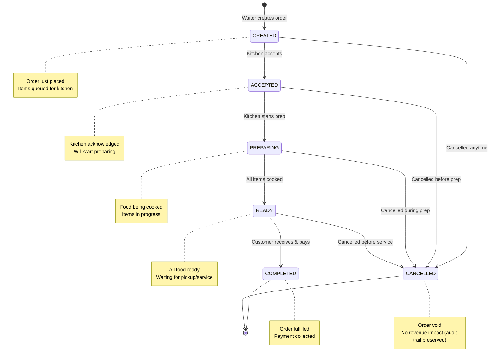
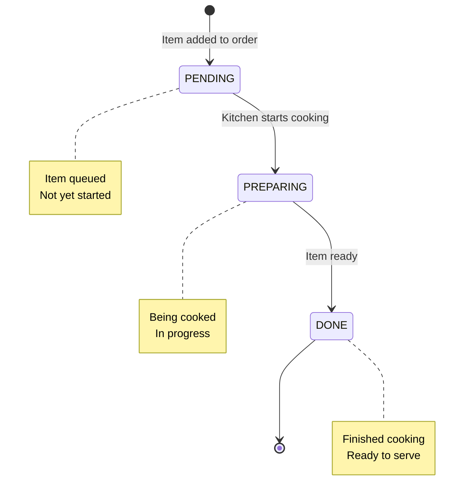
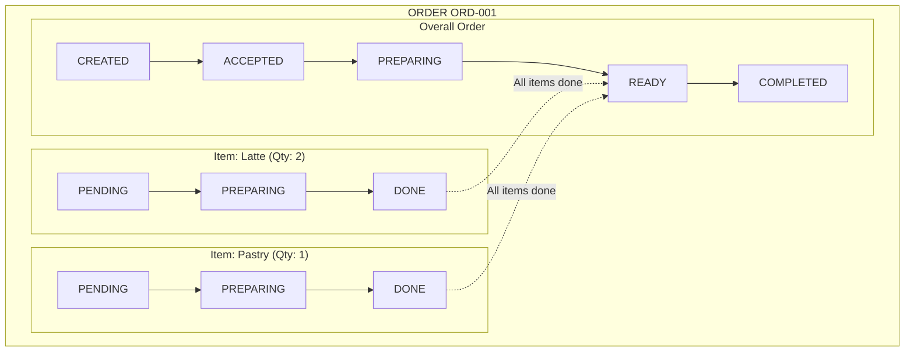

# Order State Machines & Lifecycle

## Order Status State Machine

The order lifecycle is a state machine with defined transitions.



---

## Valid State Transitions

```
CREATED
  ↓ (Kitchen accepts)
  ACCEPTED
    ↓ (Start cooking)
    PREPARING
      ↓ (Finish cooking)
      READY
        ↓ (Serve & collect payment)
        COMPLETED

CANCEL ANYTIME FROM:
- CREATED (no work done)
- ACCEPTED (cancel before start)
- PREPARING (stop cooking)
- READY (don't serve)
→ CANCELLED
```

### State Transition Rules

| From | To | Condition | Who | Example |
|------|----|-----------|----|---------|
| CREATED | ACCEPTED | Kitchen ready to start | KITCHEN | "Okay, confirmed" |
| ACCEPTED | PREPARING | Start cooking | KITCHEN | "Starting now" |
| PREPARING | READY | Food complete | KITCHEN | "Ready for service" |
| READY | COMPLETED | Served & paid | WAITER/ADMIN | "Payment done" |
| ANY | CANCELLED | Cancellation | WAITER/ADMIN | "Customer changed mind" |

---

## Order Item Status State Machine

Each item in an order progresses independently through kitchen stages.



### Item-Level Detail

```
Latte (Quantity: 2)
├─ Item 1: PENDING → PREPARING → DONE
└─ Item 2: PENDING → PREPARING → DONE

Pastry (Quantity: 1)
└─ Item 1: PENDING → PREPARING → DONE

Order Status Logic:
- If ANY item PENDING/PREPARING → Order status PREPARING
- If ALL items DONE → Order status READY
```

---

## State Definitions

### CREATED
- **When**: Waiter creates order
- **Duration**: 0-5 minutes (kitchen acceptance time)
- **Display**: "New Order" / Gray badge
- **Kitchen View**: Red/urgent, needs immediate attention
- **Actions Available**:
  - ✅ Add more items
  - ✅ Update special instructions
  - ✅ Cancel order
  - ❌ Mark as completed
- **Notification**: Kitchen gets alert

### ACCEPTED
- **When**: Kitchen confirms receipt
- **Duration**: 0-30 seconds
- **Display**: "Accepted" / Blue badge
- **Actions Available**:
  - ✅ Start preparing (item status update)
  - ✅ Cancel order (emergency)
  - ❌ Add items (disallowed once accepted)
- **Transition**: Kitchen starts cooking within 30s

### PREPARING
- **When**: Kitchen starts cooking
- **Duration**: Variable (5-30 minutes typically)
- **Display**: "Preparing" / Yellow badge
- **Progress Tracking**: Item-by-item status
  - Item 1: PREPARING
  - Item 2: PREPARING
  - Item 3: DONE
- **Actions Available**: Cancel (with penalty)
- **Notification**: Periodic updates to waiter

### READY
- **When**: ALL items cooked
- **Duration**: 0-10 minutes (pickup time)
- **Display**: "Ready!" / Green badge w/ highlight
- **Actions Available**:
  - ✅ Collect payment
  - ✅ Mark completed
  - ✅ Cancel (rare)
- **Notification**: Waiter gets HIGH PRIORITY alert
- **Sound**: Yes (important notification)

### COMPLETED
- **When**: Payment collected
- **Duration**: End state
- **Display**: Archived / Gray
- **Actions Available**: None (immutable)
- **Audit Trail**: Preserved forever
- **Revenue Impact**: Final +1 to restaurant revenue

### CANCELLED
- **When**: Any point up to READY (including READY)
- **Duration**: End state
- **Display**: Crossed out / Red
- **Reason Tracking**: Optional cancellation reason
- **Audit Trail**: Preserved forever
- **Revenue Impact**: None (no payment collected)
- **Kitchen Impact**: Stop cooking, discard items

---

## State Transition Logic in Code

### Update Order Status Endpoint

```typescript
// PATCH /api/v1/orders/:id
async update(req: AuthenticatedRequest, res: Response): Promise<void> {
  const { status } = req.body;
  const orderId = req.params.id;
  const currentOrder = await db.query(
    'SELECT status FROM orders WHERE id = $1',
    [orderId]
  );
  
  const validTransitions = {
    'CREATED': ['ACCEPTED', 'CANCELLED'],
    'ACCEPTED': ['PREPARING', 'CANCELLED'],
    'PREPARING': ['READY', 'CANCELLED'],
    'READY': ['COMPLETED', 'CANCELLED'],
    'COMPLETED': [], // No transitions from completed
    'CANCELLED': []  // No transitions from cancelled
  };
  
  const currentStatus = currentOrder.status;
  
  if (!validTransitions[currentStatus].includes(status)) {
    throw new Error(`Cannot transition from ${currentStatus} to ${status}`);
  }
  
  // Update order
  await db.query(
    'UPDATE orders SET status = $1, updated_at = NOW() WHERE id = $2',
    [status, orderId]
  );
  
  // Broadcast event
  eventBroadcaster.broadcastOrderUpdated({
    order_id: orderId,
    status: status,
    ...
  });
}
```

---

## Order Completion Lifecycle

### Detailed Flow with Timestamps

```
TIME     EVENT              STATUS      NOTES
-----    -----              ------      -----
12:00    Waiter creates     CREATED     Order #001 at Table 5
         order              
         
12:01    Kitchen accepts    ACCEPTED    "Confirmed, starting now"
         
12:02    Kitchen starts     PREPARING   All 3 items in progress
         cooking            
         
12:12    Item 1 done        PREPARING   Latte ready (Item 1/3 done)
         
12:14    Item 2 done        PREPARING   Pastry ready (Item 2/3 done)
         
12:16    Item 3 done        READY       All ready! (Item 3/3 done)
                             Alert waiter with HIGH priority
                             
12:17    Waiter serves      READY       Customer has food
         customers          
         
12:18    Waiter collects    COMPLETED   ₹450 cash payment
         payment            
         
12:18    Order archived     COMPLETED   Final state
```

---

## Edge Cases & Special Scenarios

### Scenario 1: Customer Changes Mind (CREATED → CANCELLED)

```
12:00 Order created
12:01 Customer: "Actually, I don't want that"
12:01 Waiter cancels order

Result: 
- Order status: CANCELLED
- Kitchen: Never sees order
- Revenue: ₹0
- Audit trail: "Cancelled before kitchen accepted"
```

### Scenario 2: Partial Cancellation (Mid-PREPARING)

```
12:00 Order: 2 Lattes + 1 Pastry (CREATED)
12:01 Kitchen accepts (ACCEPTED)
12:02 All items start cooking (PREPARING)
12:10 Waiter: "Actually, cancel the pastry"

Result:
- Cannot partially cancel (all-or-nothing)
- Options:
  A) Cancel entire order, re-create without pastry
  B) Complete order as-is, don't charge for pastry (manual adjustment)
- Recommendation: Complete & adjust payment
```

### Scenario 3: Order Delayed Past Threshold

```
delay_threshold_minutes = 15

12:00 Order created (CREATED)
12:01 Accepted (ACCEPTED)
12:02 Start cooking (PREPARING)
12:16 ALERT: Order delayed (>15 min)
12:20 Item 1 done (Still PREPARING)
12:22 Item 2 done (READY)

Background Job Flow:
- Every 1 min: Check orders in CREATED/ACCEPTED/PREPARING
- If elapsed > threshold: Emit ORDER_DELAYED event
- Waiter sees: "⏰ Order #001 delayed! (21 min elapsed)"
- Notification priority: HIGH
```

### Scenario 4: Network Disconnection During Update

```
Waiter: Offline (no network)
Waiter: Tap "Mark as READY" → Fails locally
App: Queue the action (store in local state)

App: Network reconnected
App: Retry queued action
API: PATCH /orders/001 {status: READY}
API: Success
App: Update UI

Result: Action completes automatically when connected
```

---

## State Diagram: Item-Level Progression



---

## Transition Validation

### What each role CAN do

| Role | Can Set Status | From | To |
|------|---|---|---|
| WAITER | ✅ | CREATED | ACCEPTED |
| WAITER | ✅ | READY | COMPLETED |
| WAITER | ✅ | ANY | CANCELLED |
| KITCHEN | ✅ | ACCEPTED | PREPARING |
| KITCHEN | ✅ | PREPARING | READY |
| KITCHEN | ❌ | Other operations | |
| ADMIN | ✅ | ANY | ANY |

---

## Analytics & Reporting

### State-Based Metrics

```
Daily Orders by Status:
- CREATED: 2    (not yet accepted)
- ACCEPTED: 5   (in queue)
- PREPARING: 8  (cooking)
- READY: 3      (waiting)
- COMPLETED: 45 (fulfilled, ₹22,500)
- CANCELLED: 3  (voided, ₹0)
Total: 66 orders

Average Time in Each State:
- CREATED → ACCEPTED: 0.5 min
- ACCEPTED → PREPARING: 0.3 min
- PREPARING → READY: 12.5 min
- READY → COMPLETED: 2.1 min
Total Average Fulfillment: 15.4 minutes

Performance Metrics:
- Orders completed on-time (< 15min): 38/45 (84%)
- Delayed orders (> 15min): 7/45 (16%)
- Order cancellation rate: 3/48 (6%)
```

---

## Testing State Transitions

### Unit Test Cases

```typescript
describe('Order State Machine', () => {
  test('CREATED → ACCEPTED is valid', () => {
    expect(isValidTransition('CREATED', 'ACCEPTED')).toBe(true);
  });
  
  test('CREATED → PREPARING is invalid', () => {
    expect(isValidTransition('CREATED', 'PREPARING')).toBe(false);
  });
  
  test('Any state → CANCELLED is valid', () => {
    ['CREATED', 'ACCEPTED', 'PREPARING', 'READY'].forEach(status => {
      expect(isValidTransition(status, 'CANCELLED')).toBe(true);
    });
  });
  
  test('COMPLETED → CANCELLED is invalid', () => {
    expect(isValidTransition('COMPLETED', 'CANCELLED')).toBe(false);
  });
  
  test('Emit event on status change', async () => {
    const order = await updateOrder(orderId, { status: 'READY' });
    expect(broadcastedEvent).toBe('ORDER_READY');
    expect(broadcastedEvent.order_id).toBe(orderId);
  });
});
```

---

## Summary

**Key Points:**
1. **Linear Progression**: Orders move forward through states (no backward transitions except cancellation)
2. **Cancellation Always Allowed**: Can cancel from any non-terminal state
3. **Item Independence**: Items progress individually, order status depends on slowest item
4. **State Broadcasts**: Every transition broadcasts a WebSocket event
5. **Audit Trail**: All state changes are logged forever for accountability
6. **SLA Tracking**: Background job monitors delays across states
